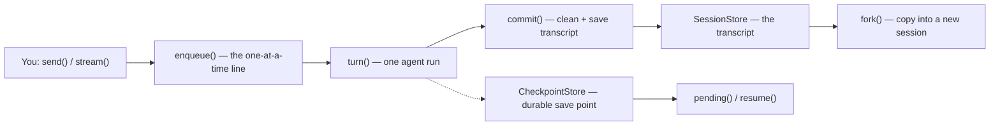

## What this is

`agent.send()` forgets everything between calls — every run starts from an empty history. `AgentSession` is the memory on top: like a game's save file, it keeps the conversation **transcript** across turns, feeds the whole history back into each new turn, and writes progress to a store so a crash can pick up where it stopped. The transcript is the conversation *without* the system prompt — the agent re-supplies its instructions every turn.

## The mental model



Five things exist: the **transcript** (the saved conversation), the **turn** (one `send()` = one agent run), the **queue** (`enqueue()`, a promise tail that serializes calls), the **checkpoint** (a durable save point mid-turn), and the **fork** (a copied transcript that becomes a new session).

## How it works

1. **You call `session.send(input)` or `session.stream(input)`.** Every public method goes through `enqueue()` — a promise tail — so concurrent calls run in call order and never interleave.
2. **The queue runs your turn.** `send()` → `nextTurn()` → `turn()`: `beforeTurn` first resumes any pending checkpointed turn, then hands the injected `SessionRunner` closure `[...transcript, ...toMessages(input)]` — the whole history plus your new input. One runner call is one `AgentExecutor.execute()`, i.e. one run.
3. **A durable turn claims a checkpoint key.** With a `checkpointStore` configured, `turnCheckpoint()` derives the key `<sessionId>.turn-<transcriptLength>` from committed state, so a fresh process can find the same checkpoint again.
4. **The result is committed.** `commit()` strips the leading `system` message, truncates with `providerValidPrefix()` to the longest prefix where every assistant tool call has its result, stamps the session's cumulative spend on the last message's `metadata.sessionUsage` (when `limits` is set), and writes via `store.save(id, messages)`.
5. **A crash mid-turn leaves the checkpoint.** `session.pending()` loads it and maps its status to `{ 'in-progress' | 'awaiting-approval', approvalId?, approvalKind? }`; `session.resume()` re-invokes the runner with `input: []`, which makes `loadRunState` rehydrate instead of appending; `session.discardPending()` deletes it.
6. **`fork()` branches the save file.** `fork({ fromStep, id?, patch? })` calls `forkTranscript()`, saves the trimmed transcript under a new id, then `spawn()`s a new `AgentSession` with identical options.

## Under the hood

**Session vs run vs step.** A *session* is the conversation across turns (its `id` + transcript). One `send()`/`stream()` is one *turn* — exactly one `AgentExecutor.execute()` call, i.e. one run. A *step* is one model call inside that run (`checkpoint.stepIndex`). `session.history()` numbers steps 1-based across the whole session, each assistant message plus its tool results.

**Busy gating and turn policy.** `idle()` gates `compact()`/`clear()`/`fork()`, rejecting `LOUSHO_SESSION_BUSY` while a turn is in flight (and `LOUSHO_SESSION_TURN_PENDING` / `LOUSHO_SESSION_AWAITING_APPROVAL` while a checkpointed turn is unfinished). `turnPolicy` changes what a call does during a running turn: `'wait'` (default) queues as the next turn; `'queue'`/`'steer'` push the input into the running turn's `InputQueue` and resolve with *that* turn's result.

**Durable turns (LOU-W9).** `checkpointStore` can come from `store.checkpoints`, a `SessionStores` object, or the `checkpointStore` option. A checkpoint found in `'finished'` status — a crash between finish and commit — is adopted straight into the transcript rather than re-run.

**Forking (N3a).** `forkTranscript` keeps messages through step `fromStep`'s last tool message, applies `patch.toolResult` in place (`withToolResult`), trims via `providerValidPrefix`, and saves under `id` (default `<id>-fork-<n>`, first untaken) in the same store. The fork gets the *current* permission mode; the pending turn, approvals, and workspace side effects stay with the original.

**Streaming.** `stream()` returns a `SessionRun` immediately — a façade `AgentRun` built by `streamSessionTurn` whose events are the inner run's re-stamped under its own `runId`, with `run.done` withheld until the transcript is saved and early loop exit aborting the turn.

## In code

| Symbol | File | Role |
|---|---|---|
| `AgentSession`, `SessionOptions`, `SessionStores`, `PendingTurn` | `src/session/AgentSession.ts` | the session object, its options, the pending-turn record |
| `providerValidPrefix`, `withDefaultStores` | `src/session/AgentSession.ts` | transcript trimming; per-call store-option merging |
| `SessionRunner`, `SessionStreamRunner`, `SessionSpawner` | `src/createAgent.ts` (`agentSession()` ~line 1225) | the three closures `createAgent()` injects |
| `SessionStore`, `MemorySessionStore`, `FileSessionStore`, `encodeBytes`/`decodeBytes` | `src/session/sessionStore.ts` | transcript persistence |
| `assertSessionId` | `src/session/sessionId.ts` | id validation (Worker-safe: no Node builtins) |
| `streamSessionTurn`, `SessionTurn` | `src/session/sessionStream.ts` | the `session.stream()` wrapper |
| `transcriptSteps`, `forkTranscript`, `SessionHistoryStep`, `SessionForkOptions` | `src/session/sessionFork.ts` | step numbering and forking |

## Example

```ts
import { createAgent } from '@lousho/build-ai-agent';
import { SqliteStore } from '@lousho/build-ai-agent/sqlite';

const agent = createAgent({ model: 'openai/gpt-4o-mini', instructions: 'Be brief.' });
const store = new SqliteStore('./.lousho/agent.db'); // sessions + checkpoints in one file

const session = agent.session({ id: 'user-42', store, turnPolicy: 'queue' });
await session.send('My name is Ali.'); // crash here leaves a '.turn-0' checkpoint

const pending = await session.pending();      // { status: 'in-progress' } or null
const finished = await session.resume();      // finishes the turn without re-running it
const { text } = await session.send('What is my name?');

const fork = await session.fork({ fromStep: 2 }); // id 'user-42-fork-1', same store
```

Because the session has a `SqliteStore`, each `send()` is durable: the turn claims the `user-42.turn-0` checkpoint key before running. If the process dies mid-turn, `pending()` reports `{ status: 'in-progress' }` and `resume()` finishes the recorded work instead of restarting it. Once the turn commits, the second `send()` carries the whole transcript, so the model answers "Ali" from history. `fork({ fromStep: 2 })` copies the transcript through step 2 into a sibling session and leaves the original untouched.

## Design decisions

- **Transcript excludes the system prompt.** `commit()` strips `messages[0]` when it is `system`; the agent re-supplies instructions every turn, so editing instructions or memory blocks affects old sessions (see [context assembly](/state/context-assembly)).
- **Runners are injected, not imported.** `AgentSession` never touches `AgentExecutor` directly — `createAgent()` supplies `run`/`streamRun`/`spawn`, keeping the session layer a thin, testable state machine over three closures.
- **Checkpoint key = transcript length.** `<id>.turn-<n>` needs no extra bookkeeping and cannot collide with a fork's key, because a fork's transcript length is part of its own `isTaken` check.
- **`providerValidPrefix` on commit.** Providers reject orphaned tool calls; truncating the tail means a mid-batch pause or abort never writes a transcript a provider would refuse.
- **Id rules.** `assertSessionId` enforces `/^[A-Za-z0-9_-]{1,128}$/` — ids become file names in `FileSessionStore`, so `../`, `/` and `.` are refused at the boundary, not at the filesystem.

## Where next

- [Storage stores](/state/storage-stores) — `SessionStore` implementations and the `AgentStore` contract.
- [Context assembly](/state/context-assembly) — what gets prepended to the transcript each turn.
- [Compaction](/state/compaction) — `session.compact()` and the automatic hook.
- [Durable execution](/core/durable-execution) — the checkpoint the session's turn writes.
