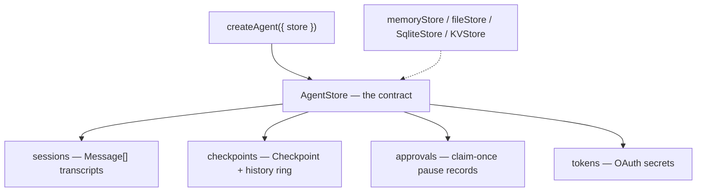

## What this is

`createAgent({ store })` takes one `AgentStore` and wires sessions, durable-execution checkpoints, pending approvals and OAuth tokens from it. Think of it like a filing cabinet with four drawers — each drawer is a small, optional sub-store, and you can swap the whole cabinet for an in-memory, file, SQLite, or KV version without changing anything else. The stores exist to make pause/resume a *data* problem: another process, or another week, can pick up where a run stopped.

## The mental model



Three things exist: the **contract** (`AgentStore` — `{ sessions?, checkpoints?, approvals?, tokens? }`), the **sub-stores** (each a small `load`/`save`/`delete` interface), and the **implementations** (`memoryStore()`, `fileStore()`, `SqliteStore`, `KVStore`).

## How it works

1. **You pass one store to `createAgent`.** Every sub-store is optional and independently overridable — `withDefaultStores` merges per-call `store`/`checkpointStore`/`approvalStore` over the agent default.
2. **`sessions` holds transcripts.** `SessionStore` persists `Message[]` per session id — see [sessions](/state/sessions).
3. **`checkpoints` holds save points.** `Checkpoint` blobs keyed by `sessionId` (session turns use `<id>.turn-<n>`); a store with `history()` also appends every `save()` to a bounded per-session ring.
4. **`approvals` holds pause records.** `ApprovalStore` saves `{ pending, snapshot }` and resolves take-once — whichever backend, exactly one caller may resume a paused run.
5. **`tokens` holds OAuth secrets** as an `OAuthTokenStore`, sealed with `tokenKey` in the file/SQLite/KV stores.
6. **You pick an implementation.** `memoryStore()` for tests, `fileStore(dir)` for zero-dependency durability, `SqliteStore` for multi-process, `KVStore` for Cloudflare Workers.

## Under the hood

**Checkpoint history (LOU-D43).** Stores with `history()` keep a bounded per-session ring (`historyLimit`, default `DEFAULT_CHECKPOINT_HISTORY_LIMIT` = 50, `0` disables); `delete()` clears it unless `{ keepHistory: true }`. This is what `AgentExecutor.fork()` replays from.

**Byte encoding.** Multimodal parts (`Uint8Array`) round-trip through JSON as `{ "$bytes": "<base64>" }` via `encodeBytes`/`decodeBytes`, shared by `FileSessionStore`, `fileStore`, `SqliteStore` and `KVStore` (which reimplements it without `Buffer`).

**fileStore layout.** `<dir>/sessions/<id>.json`, `checkpoints/`, `checkpoint-history/`, `approvals/`, `oauth/tokens|pending/`. Every write is temp-file + `rename` — a crash never leaves half a record, and there are *no lock files*, so a crashed writer can't block anyone. Approval resolution claims via `<id>.json.claim` created with `wx` (exclusive create, atomic on POSIX and NTFS; a rename is not a safe claim on Windows): of two resolvers, in one process or two, exactly one gets the snapshot.

**SqliteStore.** One `node:sqlite` file (Node ≥ 22.13, no native dep), WAL + busy timeout so several processes share it. Tables: `sessions`, `checkpoints`, `approvals`, `checkpoint_history`, `memory_items`, `oauth_*` — payloads are opaque JSON, so migrations are append-only and new checkpoint fields need no schema change. `SqliteApprovalStore.resolve` claims a row transactionally by stamping `resolved_at`; `prune({ olderThanMs })` deletes stale sessions/checkpoints/resolved approvals.

**KVStore.** For Cloudflare Workers, where `env` bindings are the only storage: keys `<prefix>sessions/<id>`, `checkpoints/<id>` (plus `#history` index + per-entry keys), `approvals/<id>`, `oauth/...`, optional per-kind `ttl`. No Node builtins, so it bundles into the Worker.

**StorageService.** The older path: `.lock`-file locking and a 10 MB JSON cap behind `LocalStorageCheckpointStore` and `StorageServiceApprovalStore` (`@lousho/build-ai-agent/utils`). New code should prefer `fileStore()` — same JSON-on-disk durability without lock files.

## In code

| Symbol | File | Role |
|---|---|---|
| `AgentStore`, `memoryStore()`, `MemoryStoreOptions`, `MemoryCheckpointStore` | `src/storage/agentStore.ts` | the contract and the in-memory implementation |
| `SessionStore`, `MemorySessionStore`, `FileSessionStore` | `src/session/sessionStore.ts` | transcript persistence (+ `encodeBytes`/`decodeBytes`) |
| `CheckpointStore`, `Checkpoint`, `CheckpointHistoryEntry`, `LocalStorageCheckpointStore`, `appendToRing`/`newestFirst`/`resolveHistoryLimit`/`toHistoryEntry` | `src/execution/checkpoint.ts` | checkpoint shape, contract, and history-ring helpers |
| `ApprovalStore`, `InMemoryApprovalStore` | `src/execution/ApprovalGate.ts`, `src/execution/InMemoryApprovalStore.ts` | `save(pending, snapshot)`, `resolve(id)`, `load(id)` |
| `fileStore(dir)`, `FileStoreOptions` (+ internal `FileCheckpointStore`, `FileApprovalStore`, `FileTokenBackend`) | `src/storage/fileStore.ts` | JSON-file implementation |
| `SqliteStore`, `SqliteStoreOptions`, `prune()`; `SqliteSessionStore`/`SqliteCheckpointStore`/`SqliteApprovalStore`, `Statements` | `src/storage/sqlite/SqliteStore.ts`, `src/storage/sqlite/stores.ts`, `src/storage/sqlite/migrations.ts` | `node:sqlite` implementation |
| `KVStore`, `KVStoreOptions`; `KVCheckpointStore`, `DEFAULT_KV_KEY_PREFIX` | `src/deploy/kvStore.ts`, `src/deploy/kvCheckpointStore.ts` | Workers implementation (subpath `@lousho/build-ai-agent/kv`) |
| `StorageService`, `readJSONAttachmentLocked` | `src/storage/StorageService.ts` | legacy `.lock`-file file I/O |

## Example

```ts
import { createAgent, fileStore, memoryStore } from '@lousho/build-ai-agent';
import { SqliteStore } from '@lousho/build-ai-agent/sqlite';

const agent = createAgent({ provider, store: fileStore('./.lousho') });

const store = new SqliteStore('./.lousho/agent.db'); // or ':memory:'
const session = agent.session({ id: 'user-42', store }); // transcript + durable turns
await AgentExecutor.execute({ agent, input, provider, sessionId: 'job-1', checkpointStore: store.checkpoints });

store.prune({ olderThanMs: 7 * 24 * 60 * 60 * 1000 }); // { sessions, checkpoints, approvals, oauthPending }
store.close();
```

The agent's default store is `fileStore('./.lousho')`, so anything without an override lands as JSON files on disk. The session is given a `SqliteStore` — it stores its transcript in `store.sessions` and its turn checkpoints in `store.checkpoints`, both inside `agent.db`. Passing `store.checkpoints` straight into `AgentExecutor.execute` makes a standalone (non-session) run durable under the key `job-1`. `prune()` sweeps records older than a week, and `close()` releases the database file.

## Design decisions

- **Why JSON files vs SQLite vs KV.** `memoryStore()` is for tests and scripts (copies on save/load, dies with the process). `fileStore()` is the zero-dependency durable option for one Node process or a small deployment — human-inspectable, atomic writes, but the checkpoint-history ring is a read-modify-write so two processes can lose an entry. `SqliteStore` is the multi-process answer: transactions make approval claims and history truncation safe across writers, and `prune()` gives retention. `KVStore` is the only option on Workers; it accepts KV's ~60 s eventual consistency and non-atomic read-modify-write, so a session's requests should be routed to one location (e.g. a Durable Object) when double-writes matter.
- **Approval `resolve` is take-once.** Whichever backend, exactly one caller may resume a paused run: `wx` claim files (file), a `resolved_at` transaction (SQLite), get+delete (KV). Duplicate human decisions can't double-resume a run.
- **Opaque JSON payloads.** The stores never inspect `Checkpoint.messages` or snapshot internals — forward compatibility for free; the cost is no queries beyond key lookup, which nothing needs.
- **`history()` is optional.** Simple stores stay minimal; `getCheckpointHistory()` returns `undefined` so callers can feature-detect fork/replay support.
- **Interfaces over inheritance.** `SessionStore`/`CheckpointStore`/`ApprovalStore` are structural — a Postgres or Redis backend is a five-method class, not a fork of the SDK.

## Where next

- [Sessions](/state/sessions) — how `AgentSession` uses `SessionStore` and `CheckpointStore`.
- [Durable execution](/core/durable-execution) — the `Checkpoint` shape these stores persist.
- [Memory](/state/memory) — `MemoryProvider` storage is a separate, smaller contract.
- [Context assembly](/state/context-assembly) — how a stored transcript re-enters a run.
