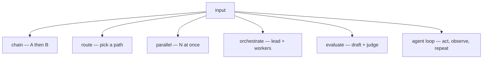

## What this is

Everything so far lives inside one call or one window; *workflow* patterns are about what happens across calls. They are the org chart of an agent system: who works in sequence, who routes, who works in parallel, who delegates, who grades. Anthropic's canonical five — prompt chaining, routing, parallelization, orchestrator-workers, evaluator-optimizer — plus the shape every `createAgent` gets for free: the autonomous tool loop.

Each pattern is a different answer to the same question: a model call produced something — where does it go next, and who decides?

## The mental model

Every pattern is a different arrangement of the same unit — one model call:



Hold three nouns: the **call**, the **edge** (how a result reaches the next call — a variable, a `task` result, a handoff), and the **gate** (what decides the edge — a condition, a verdict, a permission).

## How it maps to Lousho

Each pattern reduces to a small set of primitives — `llmCall`/`oneOf`/`parallel` flow nodes, `task` sub-agents, handoffs:

| Pattern | Shape | Machinery | Example | Internals |
|---|---|---|---|---|
| Prompt chaining | step → step → step | `sequence` of `llmCall` nodes, `{{var}}` interpolation | `phase-pipeline` | [flows](/compose/flows) |
| Routing | classify → dispatch to specialist | `llmCall` → `oneOf`; durable: handoffs | `workflow-router`, `support-desk` | [flows](/compose/flows), [handoffs](/compose/handoffs) |
| Parallelization | N calls at once, results merged | `parallel` flow node, or N `task` calls (`toolConcurrency` defaults to unbounded) | `deep-research`, `waves` | [sub-agents](/compose/subagents) |
| Orchestrator-workers | lead decomposes, workers execute | lead `task` fan-out + a synthesis turn | `deep-research` | [sub-agents](/compose/subagents) |
| Evaluator-optimizer | draft → score → revise loop | `llmCritique()` scores the draft, feedback re-seeded per iteration | `evaluator-loop` | [evals](/quality/evals) |

Two rows share machinery on purpose: chaining works because `{{var}}` interpolation carries one node's `outputVariable` into the next prompt, and `deep-research` appears twice because a lead fanning out `task` calls and synthesizing the results *is* orchestrator-workers — the only difference is who wrote the subtasks (the lead's decomposition, not a static list).

The distinction that matters when choosing a row: in a **flow**, the edges are written down before any call runs; in the **loop**, the model picks the next edge each step. Everything else — the table, the examples — is those two extremes combined.

## Under the hood

### The autonomous loop

The default `createAgent` tool loop *is* a pattern — ReAct: reason, act (a tool call), observe (the tool result), repeat. It's bounded by `maxSteps`, `limits`, permissions and approvals — the loop improvises; the bounds don't ([execution loop](/core/execution-loop), [run lifecycle](/core/run-lifecycle)).

Two refinements worth naming:

- **Bounded retry ladder** — an explicit `oneOf` chain (attempt → check → attempt → check) instead of an open `while`. The `phase-pipeline` example uses this because `FlowExecutor` has no runtime `loop` node — see [flow vs. loop](/design/flow-vs-loop).
- **Steer** — `run.steer()`/`session` turn policies inject user input mid-loop; the model call aborts and the step retries with the queued input (`'steered'` outcome).

### Handoffs

Routing where control *transfers* wholesale: `transfer_to_<name>` is offered like a tool and gated like one — permissions, hooks and approvals all apply — but it is never *executed*; a call to it is settled as a switch of `state.options` to the target agent. `activeAgentOf` markers resume the right agent after a restart; `maxHandoffs` (default 5) bounds the walk. Internals: [handoffs](/compose/handoffs).

Choosing between `oneOf` and a handoff is choosing who owns the conversation afterward: a `oneOf` branch returns and the flow continues; a handoff target owns every later turn — which is why `support-desk` uses handoffs, not sub-agents, for specialists who should talk to the customer themselves.

## Example

Routing as a flow — classify once, then run the matching branch:

```ts
const steps: EditorStep = {
  type: 'sequence',
  steps: [
    { type: 'llmCall', prompt: 'Classify: {{request}}', outputVariable: 'route' },
    { type: 'oneOf', options: [
      { condition: "route === 'billing'", step: billingStep },
      { condition: "route === 'tech'",    step: techStep },
      { step: fallbackStep }, // no condition = default
    ]},
  ],
};
```

The first node writes `route`; `oneOf` runs the first option whose condition holds. The model fills the classifier; the harness guarantees exactly one branch runs — the model can't pick two, or none.

## Design decisions

- **One primitive per role.** Flows own ordering, `task` owns breadth, handoffs own transfer — the named patterns compose them rather than the SDK adding a runtime per pattern *(inferred)*.
- **The loop is the default for a reason.** ReAct covers the open-ended case; the named patterns exist for the cases where "figure it out" isn't a contract — order that must hold, breadth that must converge, a verdict that must be typed *(inferred)*.
- **Transfer is gated, not trusted.** `transfer_to_*` passes the same permission/hook gate as any tool call, so routing control inherits the enforcement layer for free.

## Where next

- [Wave engineering](/techniques/wave-engineering) — bounded parallel waves with a verify gate
- [Phase engineering](/techniques/phase-engineering) — deterministic phase pipelines
- [Flows internals](/compose/flows) — every node type and its semantics
