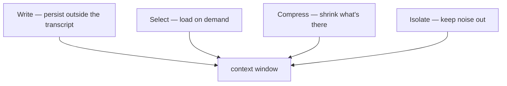

## What this is

A model call sees nothing but its context window: a fixed-size scratchpad holding the system prompt, the transcript and every tool result so far. Context engineering is deciding what occupies that space on any given turn. The analogy is a desk: facts needed later get *filed* somewhere durable, references get *fetched* only when relevant, the pile gets *summarized* before it overflows, and messy jobs get *sent to another room* so the desk stays usable.

The SDK splits the problem into four operations, each with dedicated machinery — knowing which operation is failing is the diagnostic skill.

## The mental model

Four verbs act on one finite window:



Hold four verbs — **write**, **select**, **compress**, **isolate** — plus the window itself. When a long-running agent degrades, the question to ask is which of the four failed.

## How it maps to Lousho

| Operation | Question it answers | Machinery | Internals |
|---|---|---|---|
| Write | What must outlive this turn? | `defineMemory` → `remember_*`/`recall_*` tools, pluggable stores | [memory](/state/memory), [storage stores](/state/storage-stores) |
| Select | What deserves space *now*? | `load_skill`, `tool_search`, memory scopes | [skills](/compose/skills), [tool search](/tools/tool-search) |
| Compress | The window is filling — what shrinks? | `createCompactionHook`, `session.compact()` | [compaction](/state/compaction) |
| Isolate | What work is too noisy to host? | `task` sub-agents, `run_code`, handoff `inputFilter` | [sub-agents](/compose/subagents), [code mode](/tools/code-mode), [handoffs](/compose/handoffs) |

The four operations are complementary, not alternatives: write keeps durable facts out of the window entirely, select admits material only while it's needed, compress reclaims space the transcript has already spent, and isolate prevents the noise from arriving in the first place. A well-run agent uses all four.

All of it hangs on one hook pipeline: selection and compression happen inside `preGenerate` — the hook that runs right before each model call — while write and isolate change *what exists* (tools, stores, sub-agent runs) rather than *what the next call sees*.

## Under the hood

**Write — persist outside the transcript.** Anything left in the transcript eventually scrolls off or gets compacted, so durable facts live in stores:

- `defineMemory({ name, scope, itemsProvider })` gives each slot a `remember_<name>`/`recall_<name>` tool pair, bound per-run on a `RunToolRegistry` and marked `transient` — bound tools would otherwise count as agent drift on every resume.
- Scopes: `global`, `session:<id>`, or a function of the run context — the scope key decides who shares the slot.
- Recall is a `preGenerate` hook injecting `<memory name="…">` blocks into the system message (`messages[0]`) on the run's first model call.

**Select — load only what's relevant now.** Definitions cost tokens even when unused:

- **Skills** — `load_skill` progressive disclosure: names/descriptions in the prompt, bodies on demand ([skills](/compose/skills)).
- **Tool search** — `toolSearch` defers tool definitions behind the built-in `tool_search` tool. `visibleTools`/`loadedToolNames` are *transcript-derived*, not stored: a tool is loaded when a successful `tool_search` result after the last handoff names it. So loaded state survives crash resume and fork with no new bookkeeping, a compaction that prunes the result unloads the tools, and a handoff target starts with nothing loaded ([tool search](/tools/tool-search)).
- **Memory scopes** — only the relevant scope's `recall_*` is offered.

**Compress — shrink what's there.** `createCompactionHook` is a `preGenerate` hook firing when a call's estimate passes 0.9 × context window:

- stage 1: `prune-tool-results` markers replace old tool output;
- stage 2: `summarize`/`twoPhaseStrategy` folds atomic assistant+results groups into a summary, spliced in place into `ctx.request.messages`;
- a rejected summary is marked in a `WeakSet` and that transcript is never re-summarized (LOU-R11); `session.compact()` forces a pass with `thresholdPercent: 0`.

Internals: [compaction](/state/compaction). Handoffs compress at the boundary with `inputFilter` — the receiving agent gets a filtered transcript, not the whole history.

**Isolate — run work in a clean context.** Some output is expensive to even *see*:

- **`task` sub-agents** see only their prompt — search dumps, file reads and subprocess output never flood the lead's transcript ([sub-agents](/compose/subagents)).
- **code mode** — `run_code` executes a script in a QuickJS WebAssembly isolate and returns one value; the intermediate calls stay inside ([code mode](/tools/code-mode)).

## Example

```ts
const agent = createAgent({
  provider,
  instructions: 'You triage inbound email.',
  skills: await loadSkills('./skills'),              // select
  toolSearch: { thresholdPercent: 0.1 },             // select
  compaction: { summarizer: 'openai/gpt-4o-mini' },  // compress
  subagents: { researcher: researchAgent },          // isolate
});
```

Each option pulls a different lever on the same window: `skills` and `toolSearch` keep material *out* until the model asks, `compaction` shrinks what's already *in*, and `subagents` sends the token-hungry reading to another room.

## Design decisions

- **A practical ordering, not four peers.** Write durable facts to memory → select skills/tools on demand → compress when the transcript grows → isolate anything token-hungry behind a sub-agent or digest-returning tool. Write comes first because everything downstream only protects a window that shouldn't be carrying durable facts anyway.
- **Derived over stored.** Tool-search's loaded set is recomputed from the transcript rather than kept as state — one less thing to corrupt on resume, fork or handoff.
- **Compaction is structural, not lossy.** Tool results get replaced by markers and summaries are spliced at message-group boundaries — never a raw truncation — and a rejected summary is marked so the run doesn't pay for the same failed summarization twice (LOU-R11).

## Where next

- [Context assembly](/state/context-assembly) — `extendRunOptions` ordering: skills → subagents → toolSearch → codeMode → plan/output
- [Techniques overview](/techniques/overview) — where this layer sits
