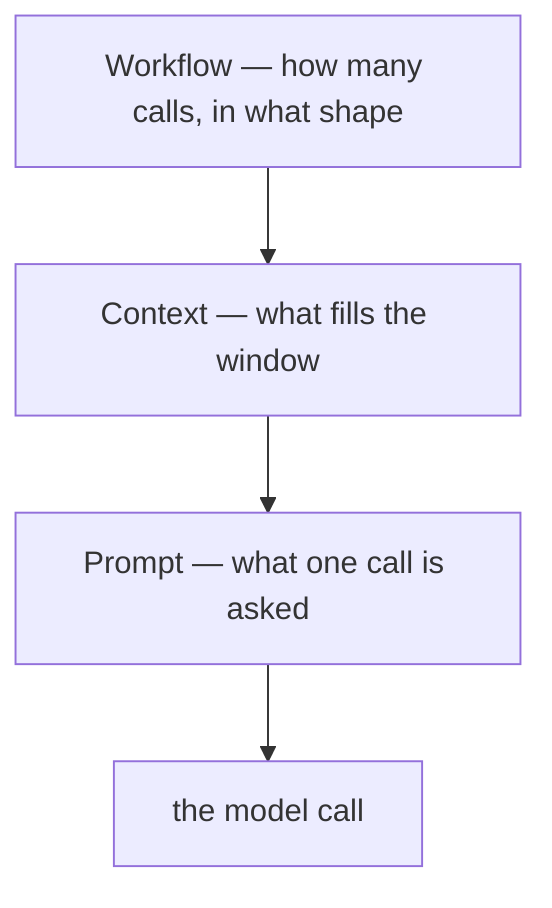

## What this is

"Agent technique" covers everything from a persona line to a parallel swarm, and those are not the same kind of thing. Each technique answers a different question about a run: what a single call is *asked*, what *fills its window*, or how many calls happen *in what shape*. The analogy is building a house: the prompt is what you tell one worker, context is what's on their workbench, and the workflow is the blueprint deciding who shows up when.

The layer matters because it decides where a technique lives in `src/` — and what to fix when it underperforms. The catalog itself (the community's full list of named techniques) lives in the SDK repo at `docs/prompting-techniques.md`; these pages assume it and explain the machinery, not the names.

## The mental model

Three layers sit on top of the same model call:



Hold three nouns: the **ask** (instructions and message shape), the **window** (the finite context a call sees), and the **shape** (calls, branches and gates across a run). Every technique in the catalog touches exactly one — few-shot lives in the ask, memory in the window, handoffs in the shape.

## How it maps to Lousho

| Layer | Question it answers | Lousho machinery |
|---|---|---|
| **Prompt-level** | What is one model call asked to do, and how is it phrased? | `instructions`/`prompt`, seeded session turns, `output` schemas |
| **Context engineering** | What fills the context window — written, selected, compressed, isolated? | memory, skills, `toolSearch`, compaction, sub-agents, code mode |
| **Workflow patterns** | How many calls, in what shape, with which gates? | the agent loop, flows, `task` fan-out, handoffs, `decide()` |

Layer 1 changes text only — cheap and portable, but unenforceable. Layers 2 and 3 are real machinery: registries, hooks and executors that hold even when the model is unpersuaded. That asymmetry is deliberate and is the section's recurring lesson.

The layer also diagnoses failure. An agent that answers in the wrong style is a layer-1 fix (reword the ask). An agent that forgets or drowns in tool output is layer 2 (the window is mismanaged). An agent that skips verification or loops forever is layer 3 (the shape needs a gate or a bound). Naming the layer first is the fastest route to the file that owns it.

## Under the hood

Lousho's design stance is to make layers 2 and 3 real machinery so layer 1 stays a thin sheet of instructions on top. "Always verify after editing" as a prompt is a suggestion; as a flow `oneOf` chain it's a guarantee. Two rules of thumb fall out:

1. **Instructions steer; machinery enforces.** Anything that must *never* happen lives in permissions, guardrails and tools — a hostile tool result can't overwrite a `deny` rule ([permission modes](/core/permission-modes)).
2. **Token-spending techniques are budgeted like any spend.** Self-consistency, trees and critiques multiply calls; `limits` (`maxTokens`, `maxOutputTokens`, `maxCostUsd`, `maxDurationMs`, `maxSteps`) bounds them — over budget the run ends `finishReason: 'budget-exceeded'` ([execution loop](/core/execution-loop)).

In the source tree the layering is literal: prompt-level knobs live in `createAgent`'s config and [context assembly](/state/context-assembly); context machinery lives under `src/context`, `src/memory`, `src/skills` and the deferral/isolation tools; workflow machinery lives under `src/flows`, `src/subagents` and `src/execution`. The docs tree mirrors that — the `state/` pages are mostly layer 2, the `compose/` pages layer 3. And the pages that follow repeat the pattern: teach the concept first, then name the machinery — because in this codebase the machinery *is* the guarantee, and the prompt is the thing it protects you from having to trust.

## In code

The entry points, one per layer — when a technique page names machinery, this is where to look first:

| Layer | Entry point | Where |
|---|---|---|
| Prompt | `createAgent({ instructions, prompt, output })` | `src/createAgent.ts` |
| Context | `defineMemory`, `loadSkills`, `toolSearch`, `createCompactionHook`, `subagents`, `codeMode` | `src/memory`, `src/skills`, `src/execution`, `src/context` |
| Workflow | `FlowBuilder`/`FlowExecutor`, `task`, `handoffs`, `decide()` | `src/flows`, `src/subagents`, `src/decisions` |

## Example

One agent config can touch all three layers at once:

```ts
const agent = createAgent({
  provider,
  instructions: 'You triage bug reports. Verify before closing.', // prompt layer: the ask
  skills: await loadSkills('./skills'),                          // context layer: select on demand
  compaction: { summarizer: 'openai/gpt-4o-mini' },              // context layer: compress
  limits: { maxSteps: 12, maxCostUsd: 0.5 },                     // workflow layer: bound the loop
});
```

`instructions` steers one call's judgement. `skills` and `compaction` decide what the window holds. `limits` bounds the loop no matter what the model wants next.

## Design decisions

- **Enforcement is a layer problem, not a wording problem.** Chosen: permissions, guardrails and tools own "never" rules; rejected: trusting instruction-following under adversarial tool output. Cost: techniques that need guarantees must reach for flow or hook machinery — deliberately.
- **One budget dial for everything that multiplies calls.** `limits` caps tokens, cost, duration and steps in one place, so a technique can't quietly spend its way around the run's contract.
- **The catalog is a map, not a feature list.** The pages that follow organize techniques by layer rather than alphabetically, so a contributor debugging a behaviour can jump straight to the layer that owns it *(inferred)*.
- **Layers compose, they don't compete.** A production agent typically uses all three at once — typed decisions routing a phase pipeline, waves inside a phase — so the section treats them as orthogonal machinery rather than alternatives *(inferred)*.

## Where next

Read them in roughly this order — each page assumes the layer beneath it:

- [Prompt-level techniques](/techniques/prompt-level) — few-shot, CoT, ReAct, personas, delimiters… all reduce to instructions + message shape. The page's point is *what not to solve in the prompt*.
- [Context engineering](/techniques/context-engineering) — the write/select/compress/isolate quadrants and the four internals pages behind them.
- [Agentic patterns](/techniques/agentic-patterns) — the canonical five (chaining, routing, parallelization, orchestrator-workers, evaluator-optimizer) plus the autonomous loop and handoffs.
- [Wave engineering](/techniques/wave-engineering) — bounded parallel waves with a verify gate (WAVES).
- [Phase engineering](/techniques/phase-engineering) — deterministic phase pipelines with a proof gate.
- [Typed decisions](/techniques/typed-decisions) — `{route, confidence}` schema decisions and the `decide()` fast path.
