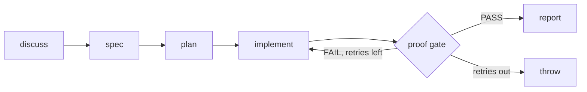

## What this is

Left to itself, an agent decides its own order — and might skip "verify" entirely. Phase engineering takes the ordering away from the model: the job moves through named phases on rails, like an assembly line, and the model only fills each station. The shape behind agentic-workflow repos (phases-oss, leeovery/agentic-workflows) is `discuss → spec → plan → implement → proof gate → report`, where the gate runs a *real check* — tests, lint, a build — and its verdict alone decides pass or retry.

`examples/phase-pipeline/` implements it on `FlowBuilder`/`FlowExecutor`. Contrast with wave engineering: waves bound *parallel breadth*; phases bound *sequential order*. Both exist because the agent loop can't guarantee either.

Reach for phases when a job has a known-good procedure — write a spec, then a plan, then code, then prove it — and skipping a step is a defect, not a shortcut. If the procedure isn't known up front, the pattern doesn't fit: it trades the model's freedom to improvise for a guarantee it can't break.

## The mental model



Hold four nouns: a **phase** (an `llmCall` node writing a named variable), the **gate** (a `toolCall` returning `'PASS:…'/'FAIL:…'`), the **ladder** (`oneOf` nodes guarding each retry), and the **deliverable** (composed by `report` — not whichever attempt ran last).

The diagram shows the logical shape; the code spells the retry edge out differently — see the ladder below. That gap between "what the flow means" and "what the executor runs" is most of what this page teaches.

## How it maps to Lousho

| Piece | Machinery |
|---|---|
| A phase | `llmCall` node: interpolated prompt in, `outputVariable` out — `{{var}}` carries each phase's result into the next prompt |
| The ordering | `sequence` — the harness owns it; the model can't skip a phase |
| The proof gate | `toolCall` running a `defineTool` check (`run_check` → `'PASS: …'/'FAIL: …'`) |
| Branching | `oneOf` options on `check.startsWith('PASS')` — conditions, not model opinion |
| The pipeline | `FlowBuilder` (`setCode`/`setName`/`addInput`/`setFlow` — all required) → `AgentFlow` → `FlowExecutor.execute(flow, { agent, provider, variables, toolRegistry })` |

The flow is a *document*, not a function: `build()` validates it (code and name required, input names unique, `createAgent()` results rejected) before `FlowExecutor` ever runs a node — so a broken pipeline fails at build time, not mid-run.

The composition, as a walk: `llmCall` discuss → `requirements`; `llmCall` spec → `spec`; `llmCall` plan → `plan`; then the implement ladder — `maxRetries + 1` `oneOf` nodes, each guarding an `llmCall` implement + `toolCall` check on `!check.startsWith('PASS')`; then a final `oneOf` — `report` + `return '$deliverable'` on PASS, `throw` otherwise.

The pipe connecting all of it is the **variables bag**: `FlowExecutor.execute` takes a `variables` seed (`{ task, check: 'not run yet' }`), every `outputVariable` mutates it, and every later `{{var}}` or condition reads it. A phase is just a name for "the node that fills this variable."

## Under the hood

The executor's runtime shape drives every design choice here:

- **The retry ladder is unrolled, not looped.** `FlowExecutor` has no runtime `loop` node — `loop` exists only in the editor shape vocabulary and fails as `LOUSHO_FLOW_INVALID`. So N attempts are N `oneOf`-guarded attempt nodes: static, inspectable, finite — [flow vs. loop](/design/flow-vs-loop).
- **`return`/`end` don't early-exit.** A `sequence` runs every step and `return` just resolves a value — routing is expressed by `oneOf` branches containing whole sub-sequences, never by bailing mid-phase. After a PASS the remaining attempts are no-ops.
- **Proof gates are `toolCall` nodes, not model opinion.** "Did it work?" is answered by running `check` — a `defineTool` that executes the proof command (the demo really runs `node -e`) — and branching on its `'PASS:'/'FAIL:'` string. The model can't talk its way past a failing test.
- **Two expression regimes, by design.** `{{var}}` prompt interpolation is flat-keyed (`/\{\{(\w+)\}\}/` — `{{check.feedback}}` literally matches nothing), while `oneOf` conditions use `evaluateSafeExpression` with property paths and allow-listed methods (`startsWith`, `includes`). The gate returns a flat `check` *string* precisely so both surfaces work: `{{check}}` interpolates into the retry prompt and `check.startsWith('PASS')` drives the branch. Knowing which regime you're in is the working knowledge.
- **`$var` reads whole variables.** `return`/`setVariable` take `$deliverable`-style references; `{{…}}` doesn't interpolate inside object literals.
- **Plain `AgentConfig`, not a live agent.** A flow's steps run under `{ name, prompt?, settings }` — `isCreateAgentResult` rejects `createAgent()` output with a coded error (LOU-R14); a built agent runs *itself*.
- **Conditions bind `{{var}}` as data.** Inside a `oneOf` condition a `'{{input}}'` placeholder is bound as a *value*, never text-spliced — a hostile variable can't rewrite the condition's logic, only fail the comparison.
- **Editor shape ≠ runtime shape.** The flow type accepts editor-vocabulary nodes (`loop`, `condition`, `bestOfAll`, `uiComponent`…) the executor never runs; `phase-pipeline` is written entirely in runtime nodes, which is why the code reads more verbose than the diagram.

## Example

```ts
// The retry ladder: each attempt is a oneOf whose first option only runs
// while the last check didn't PASS; the default option is an empty no-op.
{ type: 'oneOf', options: [
  { condition: "!check.startsWith('PASS')",
    step: { type: 'sequence', steps: [
      { type: 'llmCall',  prompt: 'Plan: {{plan}}. Prior check: {{check}}. Implement: {{task}}', outputVariable: 'implementation' },
      { type: 'toolCall', tool: 'run_check', arguments: { implementation: '{{implementation}}' }, outputVariable: 'check' },
    ]},
  },
  { step: { type: 'sequence', steps: [] } },
]}
```

`check` starts as `'not run yet'` so the first attempt always runs; a FAIL string lands in `{{check}}` and feeds the next implement prompt directly — the feedback is the artifact. After the ladder, `report` composes spec + plan + implementation into `deliverable` and `return`s it; it exists precisely so the deliverable is *composed*, not whichever `implementation` happened to be last.

`examples/phase-pipeline/`: 7 offline tests (`mockModel` + scripted phases; the `run_check` tool really executes a `node -e` child process), live-capable on OpenRouter via `OPENROUTER_API_KEY`.

## Design decisions

- **Order is a contract the harness keeps.** Chosen: `sequence` + an unrolled `oneOf` ladder; rejected: a runtime `loop` node, or trusting the model to retry on its own. Cost: N retries means N nodes, written out — readable as a diagram for the same reason.
- **The gate verdict is a string, not an object.** `'PASS: …'/'FAIL: …'` serves both surfaces — flat `{{check}}` interpolation and `check.startsWith(...)` conditions. An object would leave the prompt side unable to read it.
- **Failure after the ladder is `throw`, not a quiet report.** A pipeline that exhausted its retries must not ship a "deliverable" — the final `oneOf` fails loudly instead.
- **The gate is opt-in but recommended.** `buildPhaseFlow` accepts a missing `gate` (the implement phase becomes a single `llmCall`, the final `oneOf` passes unconditionally) — useful for testing the skeleton, useless as a guarantee.

## Where next

- [Flows internals](/compose/flows) — the editor and runtime node vocabularies, safe expressions, interpolation
- [Wave engineering](/techniques/wave-engineering) — the parallel sibling
- [Typed decisions](/techniques/typed-decisions) — what feeds `oneOf` conditions in production pipelines
