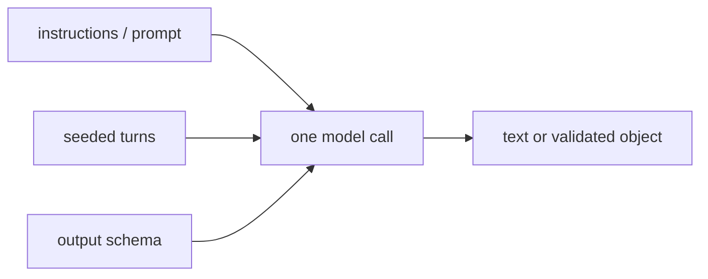

## What this is

A prompt-level technique changes exactly one thing: the text and message shape a *single* model call sees. Few-shot examples, chain-of-thought nudges, personas, delimiters — none of them add machinery; they rewrite the ask. The analogy is a work order: you can word it better, staple on examples of "done", or demand the answer on a form — but it's still one worker reading one sheet. The moment a technique needs a second call, a retry, or a check, it has left this layer.

## The mental model

Three injection points feed one call, and one of them also constrains what comes back:



Nouns to hold: the **ask** (`instructions`, persistent), the **scripted history** (seeded turns — few-shot as fake prior messages), and the **contract** (`output`, a schema the reply is validated against).

## How it maps to Lousho

In the SDK the sheet has three places to write on, all resolved during [context assembly](/state/context-assembly):

- `createAgent({ instructions, prompt })` — the persistent ask.
- seeded `session.send()` turns — `send()` accepts a `Message[]` passed through as-is, so a scripted user/assistant exchange can sit in front of the real turn (few-shot without polluting `instructions`).
- `output: schema` — the ask becomes a typed contract, enforced by [structured output](/providers/structured-output).

The catalog, mapped:

| Technique | Mechanism in Lousho |
|---|---|
| Zero-shot | Default: `instructions` only |
| Few-shot | Example pairs in `instructions`, or seeded session turns |
| Chain-of-thought | Instructions — but prefer `reasoning` effort; signed reasoning tokens are cleaner than prompted monologue ([reasoning](/providers/reasoning)) |
| Reflexion-lite | Instructions alone only critique *within* one call — real retry needs the [evaluator pattern](/techniques/agentic-patterns) |
| Least-to-most | Ordered steps in `instructions`, or a `flows` sequence when order must hold |
| Self-ask / generated knowledge | First `llmCall` writes a variable, second prompt interpolates it |
| Meta-prompting | `llmCall` emits the next step's prompt text into a variable |
| Persona | `instructions` — scope and tone only; personas don't add knowledge |
| Negative / constrained | Style in instructions; *enforcement* in guardrails and permissions — never the prompt |
| Delimiters / trust hierarchy | Quote tool results in instructions; the real boundary is `principal` + permission rules |
| Scratchpad | A memory slot, a workspace file, or `.claude/scratchpad/` via `claudeProject()` |
| Structured output | `output: zodSchema` — validated, typed, one repair retry |

Read the table's last column as an escape hatch: whenever a row needs more than text — order, retry, enforcement — the "mechanism" points out of this layer entirely. That is the page's point: *what not to solve in the prompt*.

## Under the hood

Why exactly three injection points: a model call only ever sees a system block plus a transcript, and every prompt-level lever lands in one or the other. `instructions`/`prompt` become the system message; seeded turns are just messages that happen to precede the real one (`send()`/`stream()` pass a `Message[]` through unchanged); `output` straddles both — [context assembly](/state/context-assembly) appends the output instruction *last* in the system prompt so nothing crowds it out, and the provider side validates the reply, allowing one repair step (counted against `maxSteps`) on a malformed result.

`reasoning` earns its row in the catalog because provider-native thinking is *data*, not text: signed reasoning tokens are retained across turns (`replaysReasoning`) and surface as `reasoning` events, while a prompted "think step by step" produces ordinary text nobody downstream can verify or reuse.

One subtlety the table hides: `instructions` doesn't have to be a string constant — like `model` and `tools` it can be a function of the run context, so `send()`'s `metadata` can vary the ask per turn without touching machinery.

The layer also has a hard ceiling worth stating plainly: prompt techniques can change *what the model is likely to do* and nothing else. The moment correctness, order or a guarantee matters, the technique belongs to [context engineering](/techniques/context-engineering) or the [workflow layer](/techniques/agentic-patterns) — which is why so many catalog rows end in a link out.

## Example

```ts
const agent = createAgent({
  provider,
  instructions: [
    'You are a terse senior reviewer.',                       // persona
    '## Examples',                                            // few-shot
    'BAD: `var x = getData()` → name it for what it holds',
    '## Rules',
    'Never suggest deleting tests. Quote code in backticks.', // constraints
  ].join('\n'),
  output: z.object({ issues: z.array(z.string()), verdict: z.enum(['ship', 'fix']) }),
});
```

One `instructions` block carries the persona, the few-shot pair and the style rules — that is the whole prompt layer. `output` does the other half: instead of *asking* for a verdict, it *requires* `{issues, verdict}`, validated, with one repair retry if the model answers in malformed JSON. Nothing here can stop the model from suggesting a test deletion in prose — only a permission rule could, and that lives in a different layer.

## Design decisions

- **Prompted monologue is deprecated internally.** Chain-of-thought via instructions produces untraceable text; the `reasoning` option produces provider-native thinking blocks that are signed, retained across turns (`replaysReasoning`) and rendered as `reasoning` events.
- **Self-consistency / tree-of-thoughts are not prompt techniques here.** Sampling N answers or exploring branches is a *workflow* — `parallel` flow nodes or `task` fan-out ([wave engineering](/techniques/wave-engineering)) — because the machinery (concurrency, aggregation) already exists.
- **Enforcement never lives in the prompt.** "Never delete files" as text survives until a tool result talks the model out of it; `permissions: { rules: [...] }` survives forever.
- **Repair is bounded.** `output` gets exactly one repair step, counted against `maxSteps` — a schema the model can't satisfy fails the run instead of looping on retries.

## Where next

- [Context assembly](/state/context-assembly) — where `instructions` lands in the request
- [Structured output](/providers/structured-output) — the `output` enforcement path
- [Agentic patterns](/techniques/agentic-patterns) — the layer above
