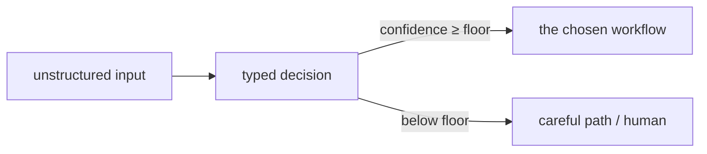

## What this is

Some steps in a workflow shouldn't write anything — they should *answer a question*. Route this ticket. Is this spam? How severe? The typed-decision pattern (TypeSafe's Jev builds a whole model on it) turns that into a contract: unstructured state goes in, a typed `{ route, confidence, reason }` comes out, and the workflow branches on fields instead of parsing prose. The analogy is a form versus an essay — a checkbox answer can drive a conveyor belt; a paragraph can't.

The `confidence` field is the honest part: a low score routes the work to a careful path or a human, rather than acting on a guess. Without it, a wrong route and a confident route look identical downstream — the floor is what separates "the model chose" from "the model was sure".

## The mental model



Three nouns: the **decision** (validated JSON, not prose), the **floor** (the confidence threshold that converts a bad guess into an escalation), and the **route** (the `oneOf` branch the decision selects).

## How it maps to Lousho

Two implementations of the same pattern — pick by where the decision lives:

| Path | Mechanism | When |
|---|---|---|
| `output` schema + `oneOf` | Any provider; the deciding agent returns validated JSON the flow branches on | Provider-agnostic; inside a larger pipeline |
| `decide()` | `POST {baseURL}/decisions` — `predicate` / `choice` / `score` question types, calibrated probabilities, roughly 10× faster than a Responses turn, no generated prose | OpenAI only (public beta; `gpt-6-luna`); standalone classify/route/score |

The first row is the pattern, portable; the second is a purpose-built endpoint that happens to serve the same shape faster. Anything `decide()` can express, `output` + `oneOf` can express too — the dedicated path buys latency and calibration, not new semantics.

## Under the hood

- **Confidence is data, not vibes.** `confidence < 0.7 → careful path` only works because `output` validation guarantees the field exists and is numeric — a prose "I'm fairly sure" can't gate a branch. [Structured output](/providers/structured-output) is what makes the floor enforceable.
- **A malformed decision degrades to zero, not to a guess.** `coding-agent-workflows` answers an unparseable triage reply with `{ route: 'refactor', confidence: 0 }` — the careful route. No path turns a broken decision into "fix things".
- **`decide()` is a client, not a provider.** The Decisions endpoint isn't chat-completions — one `POST {baseURL}/decisions`, no tool loop, no generated prose — and it does not go through providers or OpenRouter, so it takes `OPENAI_API_KEY` (or `apiKey`/`baseURL` for a compatible endpoint) directly. Answers also carry a `refusal` type: abstention is a first-class result. See [decisions](/providers/decisions) and the [ADR](/design/typed-decisions).
- **A decision can't skip the gate.** Typed decisions select the path; the work still runs through ordinary machinery — in `coding-agent-workflows` the chosen route's flow applies the edit via a real `toolCall` (`apply_edit`) and verifies it (`verify` → `'PASS:'/'FAIL:'`) like any other gated step.
- **Questions are validated client-side.** Duplicate question names, a `choice` with no `choices`, or a `score` with fewer than two `levels` throw `LOUSHO_CONFIG_INVALID` before the POST — the endpoint never sees a malformed decision request.

## Example

The provider-agnostic path — a triage agent whose `output` is the decision schema:

```ts
const triage = createAgent({
  provider,
  output: z.object({
    route: z.enum(['fix', 'refactor', 'explain']),
    confidence: z.number().min(0).max(1),
    reason: z.string(),
  }),
});
// then a flow oneOf branches on the fields:
//   "route === 'explain' && confidence >= 0.7" → the explain step
//   "route === 'fix' && confidence >= 0.7"     → the fix workflow
//   (no condition — the default)               → the careful path
```

Because `oneOf` conditions evaluate `route`/`confidence` as real values (via `evaluateSafeExpression`), the floor is a comparison in the branch — not a hope in the prompt.

The dedicated endpoint — one POST, no agent run:

```ts
const { answers } = await decide({
  input: ticketText,
  questions: [{ type: 'choice', name: 'route', instructions: 'Which team?',
    choices: [{ value: 'billing' }, { value: 'other' }] }],
});
// answers[0]: { type: 'choice', choice: 'billing', confidence: 0.93, ... }
```

## Design decisions

- **Two paths, one pattern.** `output` + `oneOf` composes inside pipelines on any provider; `decide()` trades composability for speed and calibration when a decision stands alone *(inferred)*.
- **The floor degrades, it doesn't block.** Below-floor confidence still runs a workflow — the careful one — so an uncertain model costs a safer path, not a wrong answer or a stall *(inferred)*.
- **Refusal is a shape, not an error.** The Decisions API models `refusal` as an answer type alongside `predicate`/`choice`/`score`, so "won't answer" propagates as data the caller can branch on.
- **Validation is the pattern's foundation.** Both paths lean on `output`-style guarantees — without a schema pinning `confidence` to a number, every floor and every branch is back to parsing prose *(inferred)*.

## Examples

- `examples/coding-agent-workflows/` — a deterministic workflow whose branch point is a typed decision; `confidenceFloor` default 0.7, unparseable replies degrade to `confidence: 0`; the demo decides `fix @ 0.9`.
- `examples/workflow-router/` — routing by classified intent.

## Where next

- [decide() internals](/providers/decisions) — request/response shapes, error codes
- [Structured output internals](/providers/structured-output) — repair retry, `output-invalid`
- [Flows](/compose/flows) — the `oneOf` the decisions feed
