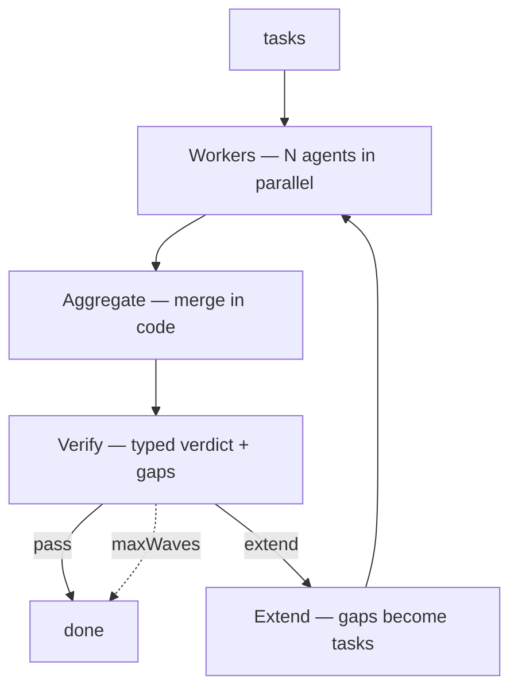

## What this is

Some jobs are too wide for one context — summarize a corpus, audit a codebase — but a plain "do it all in parallel" returns whatever the fastest guesses produced, unchecked. Wave engineering adds a verification spine: a wave of workers each takes one slice in a clean context, their output is merged, a *separate* verifier checks the merged result against the goal and names the gaps, and only those gaps seed the next wave. The analogy is a newsroom: reporters fan out across beats, the editor checks whether the whole story is covered, and sends someone back only for what's missing.

The community named the shape **WAVES**: Workers · Aggregate · Verify · Extend · Stop. The letters are the loop, in order:

1. **Workers** — N sub-agents work N slices in parallel, each in a clean context.
2. **Aggregate** — the outputs merge into one result.
3. **Verify** — a verifier checks the aggregate against the goal and emits a gap list.
4. **Extend** — if gaps exist and budget remains, the next wave's prompts are *seeded from the gaps*.
5. **Stop** — terminate on verify-pass or `maxWaves` — boundedness is the point.

## The mental model



Five nouns: **worker** (a fresh agent per slice), **aggregate** (the merged artifact), **verdict** (`{verdict, gaps[]}`), **gap** (the feedback, as data), **maxWaves** (the bound that makes the loop terminate).

## How it maps to Lousho

`examples/waves/` implements the pattern on plain `createAgent` + `agent.send()` — no flow, because the wave ordering is a property of the driver function (`runWaves`), not the model:

| WAVES step | Mechanism |
|---|---|
| Workers | `Promise.all` over `worker().send(t)` — `worker` is a *factory*, because each slice needs a clean context; `concurrency` chunks the wave |
| Aggregate | `aggregate(task, output)` — a plain function; the merge is deterministic, not an LLM call |
| Verify | `createAgent({ output: VERDICT })` → `{ verdict: 'pass' \| 'extend', gaps: string[] }` |
| Extend | `verdict.gaps.map(gapToTask)` turns each gap into the next wave's worker prompt |
| Stop | `verdict === 'pass'`, or `maxWaves`; an `'extend'` with empty `gaps` can't seed a wave, so it's treated as pass |

Each worker is a fresh context ([isolation](/techniques/context-engineering)); the driver holds all state between waves — nothing persists across `createAgent` calls except what the driver passes. That last fact is what makes the pattern debuggable: wave N's inputs are a pure function of wave N−1's verdict, so reproducing a bad wave means replaying one task list, not a transcript.

## Under the hood

- **Workers accumulate, not replace.** The driver pushes each wave's `aggregate(...)` results onto `sections` and re-joins — wave 2's artifact *extends* wave 1's rather than overwriting it. An earlier version let the aggregate overwrite, silently dropping earlier coverage; a verifier that only sees the latest wave could never notice that regression, so accumulation must be structural, not instructed.
- **Aggregate is a function on purpose.** An LLM merge can silently drop a worker's contribution and the verifier has no way to see the loss — determinism makes a dropped section a bug, not a style choice.
- **Verify is a separate agent, not a prompt line.** "Check your work" inside a worker prompt is self-grading; a distinct verifier that sees only the goal + aggregate can't rationalize output it didn't write.
- **Gaps seed the next wave directly.** The verifier's verdict is structured output (`output` schema), and `gapToTask` maps gap → worker prompt — the feedback edge is data, not prose.
- **`maxWaves` is the honest bound.** Open-ended "loop until perfect" has no termination argument; the wave count is the budget, and `limits` still apply underneath each `send()`.
- **A failed worker fails the wave.** A slice that throws aborts the run — a partial aggregate would validate against a corpus the verifier can't see.
- **The verifier is rebuilt per wave.** A fresh `createAgent` (`wave-verifier-N`) each iteration keeps earlier verdicts and aggregates out of the new verifier's context — it judges only what the driver hands it.

## Example

```ts
for (let wave = 1; wave <= maxWaves; wave++) {
  // Workers: one fresh agent per task, `concurrency` at a time.
  const waveOutputs = await Promise.all(tasks.map((t) => worker().send(t).then((r) => r.text)));
  // Aggregate: each result appended to `sections` — accumulate, not replace.
  sections.push(...tasks.map((t, i) => aggregate(t, waveOutputs[i])));
  const merged = sections.join('\n');
  // Verify: a separate agent with `output: VERDICT` returns { verdict, gaps }.
  const verdict = (await verify.send(verifyPrompt(merged, wave))).object
    ?? { verdict: 'extend', gaps: [`wave ${wave} verifier returned no parseable verdict`] };
  if (verdict.verdict === 'pass' || verdict.gaps.length === 0) return { aggregate: merged, waves: wave, verdict };
  // Extend: the named gaps become the next wave's tasks.
  tasks = verdict.gaps.map(gapToTask);
}
```

The loop is the whole pattern: fan out, merge deterministically, verify against a schema, extend only on named gaps. Even an unparseable verdict degrades safely — to `extend` with a named gap, never to silent acceptance.

The full runnable version is `examples/waves/` — offline-tested with `mockModel`, live-capable on `openrouter/openai/gpt-4o-mini` when `OPENROUTER_API_KEY` is set.

## Design decisions

- **The harness owns the wave shape.** `Promise.all` inside a `for` loop, not a flow graph — no model output can skip the verify step, because the ordering lives in `runWaves`, not in a prompt.
- **No shared worker session.** `worker` is a factory, not a pool: sharing one agent across slices would leak one worker's transcript into the next.
- **Boundedness is the point.** Extension is capped twice — `maxWaves` on iterations, `concurrency` on breadth within a wave — so the pattern has a termination argument a bare "parallelize and hope" doesn't.
- **The verifier judges coverage, not quality.** `verifyPrompt` asks whether the aggregate covers the goal — the right question when a partial answer is worse than a slow one (a corpus summary, an audit). For "is this *good*", the sibling evaluator-optimizer pattern (`llmCritique`) is the better fit *(inferred)*.

## Where next

- [Sub-agents](/compose/subagents) — the worker primitive and `BackgroundTasks`
- [Structured output](/providers/structured-output) — how the verifier's `{verdict, gaps}` is enforced
- [Phase engineering](/techniques/phase-engineering) — the sibling pattern where ordering is the contract
