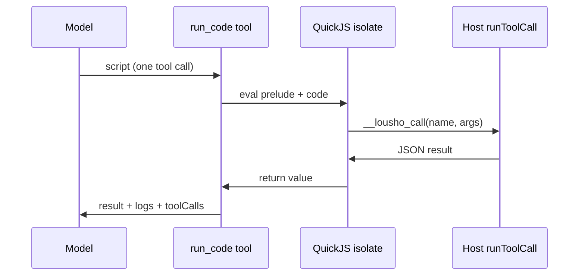

## What this is

Chained tool use normally costs one model round-trip per call — each result re-enters the transcript and the whole conversation goes back to the model. With `createAgent({ codeMode })`, the model instead writes one short JavaScript program for a `run_code` tool: the script calls tools as `await tools.<name>(args)`, loops and filters locally, and only its `return` value enters the [transcript](/glossary) (N14). One model call does the work of N. The script runs inside a **QuickJS isolate** — a small JavaScript engine compiled to WebAssembly with its own memory space, so it can't see or touch the host process. Think of it as a sealed kitchen: ingredients go in through one hatch, a finished dish comes out.

## The mental model



Five nouns to hold onto:

- **`run_code`** — the tool the model calls with a script instead of calling tools one by one.
- **Isolate** — the fresh QuickJS WASM runtime each script runs in: language only, no host objects.
- **Prelude** — trusted host-installed code that builds the `tools`/`console` objects, then deletes its own globals.
- **Host call** — a tool invocation crossing the isolate boundary, as JSON strings both ways.
- **Inner call** — an in-script tool call that runs through the same `runToolCall()` pipeline as a direct model call.

## How it works

1. **Run-start wiring registers `run_code`.** `codeModeOption()` stashes the parsed options under `Symbol('lousho.codeMode')` on the run options; `withCodeMode()` runs after tool search in the executor pipeline (`AgentExecutor.ts:683`): it eagerly `loadQuickJS()` (a missing `quickjs-emscripten` peer fails the run at start, not mid-script), refuses a name clash with an existing `run_code` tool, copies the registry, and registers a `run_code` tool whose **description embeds a TypeScript-like signature per callable tool** — `tools.get_price(args: { pair: string }): Promise<unknown>` rendered by `renderSchema()` over each tool's JSON Schema, depth-capped at 4. With `exclusive: true` the callable tools are also removed from the model's tool list — they stay in the registry, callable only from scripts.
2. **The model emits one `run_code` call with a script.** The default callable set is every run tool with an `execute`, minus `run_code`, `ask_question`, `task`, `agent_status`/`agent_await`/`agent_cancel`, `tool_search`, `load_skill`, `delegate_to_*`, and deferred tools (`NOT_BY_DEFAULT` — anything that asks the user, spawns sub-agents, or loads other tools). `codeMode.tools` narrows to an explicit list.
3. **A fresh isolate runs the script.** Each script gets a new QuickJS WASM runtime + context (`codeModeIsolate.ts`) with `memoryLimitBytes` (64 MiB), `maxStackSizeBytes` (512 KB), and an `interruptHandler` watching the deadline (`timeoutMs`, 30 s, *including* awaited tool calls) and the run's abort signal. The isolate contains only the language: no `require`, `import`, `process`, `fetch`, timers, or host objects. A trusted `prelude()` reads two injected globals (`__lousho_call`, `__lousho_log`), **deletes them from `globalThis`**, builds frozen `tools` and `console` objects, and compiles the model's code as the body of an `AsyncFunction('tools', 'console', code)`. Values cross the boundary as JSON strings only: args stringified in, results parsed out.
4. **The host drives the event loop.** `settle()` evals the prelude, then loops `executePendingJobs()` — after each pass it checks the script promise's state and waits (`nextEvent`) on the next settled host call, the deadline, or abort. `__lousho_call` returns a QuickJS deferred promise; when the host call settles, the deferred resolves/rejects and the script continues. A pending script with nothing in flight is a bug ("waiting for a promise that never settles"). Teardown awaits every in-flight host call before disposing deferreds/context/runtime.
5. **Inner calls are real tool calls.** `nestedToolCaller()` wraps each script call in a synthetic `ToolCall` (id `<run_code id>:<n>`) and runs `runToolCall()` (`toolCallExecution.ts`) with the run's context — validation, pre/post hooks, permission rules and modes ([plan mode](/core/permission-modes) refuses non-read-only inner calls; `run_code` itself advertises `readOnlyHint`), tool guardrails, `needsApproval`, sandbox routing, and the frozen principal all apply unchanged. Events carry `parentToolCallId`; tracing gives each inner call an `execute_tool` span under the `run_code` span (`lousho.tool.parent_call_id`). Concurrency is capped by a `Limiter` at the run's `toolConcurrency`.
6. **The `return` value becomes one tool message.** `run_code` returns `{ result, logs, toolCalls }` to the model — one transcript entry no matter how many tools the script called.

## Under the hood

- **Pauses become in-script errors.** `inScript()` rewrites outcomes that would pause the run — `requiresApproval`, `signIn`, a sub-agent's approval — into ordinary tool errors the script sees (`"Tool X needs approval; call it directly, not from run_code."`). Reason: an isolate can't be checkpointed and resumed, so a pause inside a script could never be honored. A *fatal* outcome (guardrail block, hook throw) is marked `markPropagating` and ends the run, exactly as it would for a direct call.
- **Result shaping teaches instead of truncating.** The script's `return` value is JSON-stringified; over `maxOutputChars` (20k, shared with `console.*` logs) the call fails with an error telling the model to filter inside the script — a gentle re-prompt instead of silent data loss.
- **`ScriptError` is debuggable.** Its `cause_` is `error | timeout | memory | tool-calls | output | aborted`; script errors include the first 3 non-prelude stack frames plus a trail of the first 5 tool calls with clipped results so the model can see result shapes it guessed wrong.
- **The peer is optional.** `quickjs-emscripten` loads via `loadOptionalPeer`; `lousho doctor` lists it.
- **Blocking is accepted.** A pure-compute script blocks the host event loop until the deadline interrupt fires — simpler than worker handoff, and `timeoutMs` bounds the damage.

## In code

| Symbol | File | Role |
|---|---|---|
| `withCodeMode()`, `codeModeOption()`, `assertCodeModeOptions()` | `src/execution/codeMode.ts` | Run-start wiring; `RUN_CODE_TOOL` = `'run_code'` |
| `nestedToolCaller()`, `NestedToolCaller`, `NOT_BY_DEFAULT` | `src/execution/codeMode.ts` | Script call → `runToolCall()`; the exclusion set |
| `loadQuickJS()`, `runScript()`, `ScriptLimits`, `prelude()` | `src/execution/codeModeIsolate.ts` | The WASM isolate, its limits, the trusted bootstrap |
| `ToolCallScope.callTool`, `bindToolCallScope()` | `src/execution/subagentRuntime.ts` | How `run_code`'s `execute` reaches the run's inner-call runner |
| `runToolCall()` | `src/execution/toolCallExecution.ts` | The gate inner calls share with direct calls |
| `Limiter` | `src/execution/toolBatch.ts` | Reused to cap a script's concurrent inner calls |

## Example

```ts
const agent = createAgent({
  model: 'openai/gpt-4o-mini',
  tools: [getPrice, convert, listAccounts],
  codeMode: {
    tools: ['get_price', 'convert', 'list_accounts'],
    exclusive: true,      // hide them; the model must go through run_code
    timeoutMs: 10_000,
    maxToolCalls: 50,
  },
});
// Model emits one run_code call:
//   const prices = await Promise.all(ids.map(id => tools.get_price({ id })));
//   return prices.filter(p => p.usd < 100);
// Transcript gains one tool message, not N.
```

`codeMode.tools` whitelists the three tools for script use; `exclusive: true` hides them from the model's direct tool list so `run_code` is the only way to call them — its description already shows each tool's signature, so the model writes correct calls in one shot. The script can `Promise.all` across calls (capped at `maxToolCalls` and the run's `toolConcurrency`) and must finish inside `timeoutMs`, which includes awaiting tool calls. Only the filtered `return` value reaches the transcript.

## Design decisions

- **QuickJS WASM, not `vm`/`eval`/worker threads.** `node:vm` is not a security boundary and shares the host heap; a WASM isolate gives real memory limits and no ambient authority — the only host surface is the two prelude functions.
- **Full pipeline for inner calls.** Routing through `runToolCall` (not a direct `execute` shortcut) means permissions, guardrails, and tracing can't diverge between "model called it" and "script called it".
- **Refuse pauses rather than emulate them.** Converting approval/sign-in into script errors keeps `run_code` honest: the model learns to call gated tools directly.
- **Blocking is acceptable.** `timeoutMs` bounds the damage a pure-compute script can do to the event loop.
- **Signatures in the description.** Embedding per-tool signatures in `run_code`'s description avoids a second discovery tool; the model writes correct calls in one shot.

## Where next

- [Tool system](/tools/tool-system) — `runToolCall`, `toolConcurrency`, the gate inner calls share.
- [Tool search](/tools/tool-search) — deferred tools are excluded from scripts by default.
- [Approvals](/core/approvals) — why pause outcomes become script errors.
- `docs/code-mode.md` — user-facing limits and events reference.
