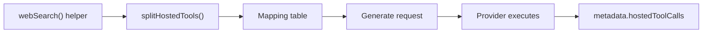

## What this is

A **hosted tool** is a tool the model provider executes *inside* the generate request — OpenAI's web search, code interpreter, or file search; Anthropic's web search or code execution; or any AI SDK provider tool via `hostedTool()`. Unlike every other tool in this section, the SDK never runs them: it sends a declaration alongside the function tools, the provider runs them on its own infrastructure, and the SDK reports the calls the provider says it made (N1a/N1b). Think of it as outsourcing: you write the work order, someone else's workshop does the job and mails back a receipt.

## The mental model



Four nouns to hold onto:

- **Helper** — `webSearch()`/`codeInterpreter()`/`fileSearch()`/`hostedTool()`; produces an inert declaration, not a real tool.
- **Split** — hosted tools travel a different path through `createAgent` than local tools.
- **Mapping table** — the per-provider record that turns a helper's options into provider arguments.
- **Reported calls** — the provider's account of what it ran, stored on the assistant message.
- **Hosted type** — `web_search`, `code_interpreter`, `file_search`, or `custom`; every behavior in this page keys off it.

## How it works

1. **Helpers produce inert descriptors.** `webSearch({ maxUses, allowedDomains, ... })` (`src/tools/hosted.ts`) returns a frozen `{ kind: 'hosted-tool', name: 'web_search', type, options }` — no `execute`, no schema. `hostedTool(name, aiSdkTool)` wraps an arbitrary AI SDK provider tool as `type: 'custom'`, passed through untouched. Because they aren't descriptors, `ToolRegistry.registerMany()` refuses them outright ("hosted tools run on the provider and cannot be registered").
2. **`createAgent` splits them out.** `splitHostedTools()` (`createAgent.ts:1048`) pulls hosted tools out of the `tools` option — in record form the key must equal `tool.name`, since the provider maps by it. `assertHostedToolNames()` throws on a hosted tool sharing a name with another hosted tool or a local tool.
3. **Support is asserted before the run.** `assertHostedToolsSupported()` (`src/execution/hostedToolCalls.ts`) asks the provider's `supportsHostedTool(type)` — the base implementation accepts only `'custom'` on `ai` 6/7; providers that map built-ins override it.
4. **A mapping table turns helpers into provider arguments.** On each `generate()`, the provider's `hostedToolsFor()` converts the helpers into real AI SDK tool objects, which merge into the request's tool set in `aiSdkCompat.ts:modernToolSet()`. See *Under the hood* for the tables.
5. **The provider runs them and reports back.** `GenerateResult.hostedToolCalls` is counted in `usage.hostedToolCalls`, stamped onto the step's assistant message as `metadata.hostedToolCalls`, and emitted as events with `executedBy: 'provider'`. `settleHostedFinish()` handles the corner case: a step whose only calls are hosted reports `finishReason: 'tool_calls'` but has nothing for the loop to run — it's rewritten to `'stop'` so the run doesn't ask the model again with nothing new.
6. **Permissions see them only at the coarsest level.** A hosted call is invisible to validation, hooks, guardrails, `needsApproval`, and `onToolCall` — it happened inside the provider. The one control is `hostedToolsInMode()` (`execution/permissions.ts`): in [`plan` mode](/core/permission-modes) only `READ_ONLY_HOSTED_TYPES` (`web_search`, `file_search`) are sent at all; `code_interpreter` runs code and `custom` is unknown, so they're withheld from the request entirely.

## Under the hood

- **Option mapping is a lookup table.** `OPENAI_HOSTED_TOOLS` (`OpenAIProvider.ts`) and `ANTHROPIC_HOSTED_TOOLS` (`AnthropicProvider.ts`) give each `HostedToolType` a factory plus a `HostedOptionMapping` — helper option → provider argument, `undefined` = not supported (`hostedToolMapping.ts:mappedHostedOptions()`). OpenAI takes `searchContextSize`, `userLocation` (wrapped as `{ type: 'approximate' }`), `allowedDomains` → `filters.allowedDomains`, and drops `maxUses`/`blockedDomains` (Anthropic-only); `fileSearch`'s `maxResults` becomes `maxNumResults`. Options the provider can't take are dropped with one `console.warn` per `provider:tool:options` key per process — an unsupported option degrades instead of failing.
- **Provider specifics.** OpenAI maps to `openai.tools.webSearch()`/`codeInterpreter()`/`fileSearch()`; Anthropic maps `web_search` to the newest `tools.webSearch_*()` it finds (`newestFactory()`) and `code_interpreter` to `codeExecution_*()` (Anthropic's name — events keep ours); `file_search` has no Anthropic equivalent and throws `LOUSHO_HOSTED_TOOL_UNSUPPORTED`. OpenRouter maps `web_search` to its plugin interface.
- **Pass-through is version-gated.** `hostedTool()` objects reach the provider as-is only on `ai` 6/7 (`aiSdkProvider.splitHostedTools`); on older majors the same `LOUSHO_HOSTED_TOOL_UNSUPPORTED` error explains what would work.
- **`fileSearch` validates eagerly.** It needs `vectorStoreIds` at creation (a missing/empty list throws `LOUSHO_CONFIG_INVALID`) because the provider-side failure would surface only inside a model call — far harder to diagnose.
- **Reported calls are shaped for the transcript.** Each call is JSON-safed, its result capped at `HOSTED_RESULT_LIMIT` (20,000 chars) of JSON, and sources kept as `{ url, title }`. They live on assistant-message metadata — not `tool` messages, because there was no client-side call to answer — which keeps replay and session stores consistent without inventing fake tool calls.

## In code

| Symbol | File | Role |
|---|---|---|
| `webSearch()`, `codeInterpreter()`, `fileSearch()`, `hostedTool()` | `src/tools/hosted.ts` | Helper factories producing inert `HostedTool`s |
| `isHostedTool()`, `assertHostedToolNames()` | `src/tools/hosted.ts` | Type guard + collision checks |
| `splitHostedTools()` | `src/createAgent.ts` | Separates `tools` into local descriptors and hosted tools |
| `assertHostedToolsSupported()`, `withHostedCalls()`, `settleHostedFinish()` | `src/execution/hostedToolCalls.ts` | Run-time support check, transcript stamping, finish fix |
| `supportsHostedTool()`, `hostedToolsFor()` | `src/providers/aiSdkProvider.ts` | Provider contract hooks |
| `OPENAI_HOSTED_TOOLS` / `ANTHROPIC_HOSTED_TOOLS` | `src/providers/OpenAIProvider.ts`, `AnthropicProvider.ts` | The mapping tables |
| `mappedHostedOptions()` | `src/providers/hostedToolMapping.ts` | Option translation + warn-once drops |
| `hostedToolsInMode()`, `READ_ONLY_HOSTED_TYPES` | `src/execution/permissions.ts` | Plan-mode filtering |

## Example

```ts
import { createAgent, webSearch, fileSearch } from '@lousho/build-ai-agent';

const agent = createAgent({
  model: 'openai/gpt-4o-mini',
  tools: [
    webSearch({ searchContextSize: 'low', allowedDomains: ['docs.example.com'] }),
    fileSearch({ vectorStoreIds: ['vs_abc123'] }), // throws if vectorStoreIds is empty
    localTool, // local and hosted tools mix freely
  ],
});
// The provider runs searches inside the request; results land on
// message.metadata.hostedToolCalls and usage.hostedToolCalls.
```

`webSearch` and `fileSearch` create declarations, not runnable tools — they sit next to `localTool` in the array, but `splitHostedTools()` routes them differently. `allowedDomains` becomes OpenAI's `filters.allowedDomains` via the mapping table. When the model decides to search, OpenAI does it; the SDK sees only the reported calls, which it stores on the assistant message and counts in usage.

## Design decisions

- **No local execution path, deliberately.** Provider tools need provider infrastructure (search index, sandboxed container, vector store); a local shim would be a different feature. The `kind: 'hosted-tool'` marker isn't a descriptor, which is why the registry rejects it rather than silently dropping `execute`.
- **Mapping tables over abstraction.** A plain `Record<HostedToolType, { factory, options }>` per provider is easier to audit than a generic option translator, and unsupported options fall out naturally as `undefined` entries.
- **Warn-once for dropped options.** Failing would break cross-provider agents; warning every call would spam. One warn per distinct drop-set is the compromise.
- **Provider runs ⇒ executor only observes.** Hosted calls are assistant-message metadata, which keeps replay and session stores consistent.
- **`fileSearch` validates eagerly** because a provider-side failure would only surface inside a model call — far harder to diagnose.

## Where next

- [Tool system](/tools/tool-system) — how local tools differ at registration and execution.
- [Providers and models](/providers/architecture) — `supportsHostedTool`/`hostedToolsFor` in the provider contract.
- `docs/hosted-tools.md` — option-by-option provider support matrix.
