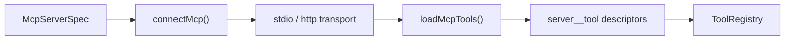

## What this is

**MCP** (Model Context Protocol) is an open protocol that lets a program advertise tools over a stdio pipe or an HTTP endpoint, so any client can discover and call them. The SDK plays both roles: an MCP *client* (`connectMcp()` loads a remote server's tools into an agent as ordinary descriptors) and an MCP *server* (`serveMcp()` exposes an agent and its tools to other MCP clients). The protocol library, `@modelcontextprotocol/sdk`, is an optional peer loaded lazily on first use — a project that never touches MCP never installs it (LOU-D19, LOU-D40). Think of `connectMcp` as a docking station: many kinds of peripherals, one desk.

## The mental model



Four nouns to hold onto:

- **Spec** — `McpServerSpec`: either `{ command, args, env }` (spawn a local process) or `{ url, headers, oauth }` (talk to a remote server).
- **Transport** — how bytes move: `StdioClientTransport` for `command`, `StreamableHTTPClientTransport` for `url`.
- **Namespacing** — each remote tool is registered locally as `server__tool`, so two servers both advertising `search` never collide.
- **Annotations** — hints the server declares on each tool (`readOnlyHint`, `destructiveHint`) that drive the default approval behavior.
- **`serveMcp`** — the mirror image: exposing one of this SDK's agents *to* MCP clients.

## How it works

1. **Specs become connections.** `connectMcp(servers, { lazy, onError, logger, tokens })` (`src/tools/mcp/connect.ts`) creates one `ServerConnection` per spec. A `url` entry gets `StreamableHTTPClientTransport` — with OAuth, the MCP SDK's `authProvider` plus `mcpFetch()`, a `fetch` wrapper that attaches the configured `headers` only to requests against the server's own origin, never to an authorization server elsewhere. A `command` entry gets `StdioClientTransport`, where a given `env` is merged onto `getDefaultEnvironment()` because the MCP SDK would otherwise replace the child's entire environment.
2. **Every server connects eagerly** — listing tools needs a live connection. Afterwards `lazy` (default `true`) reconnects transparently on the next call after `close()` or a drop (`client.onclose` marks the connection closed). `onError: 'skip'` leaves a failing server out with a warning; `'throw'` closes everything and rethrows. Statuses: `idle | connected | failed | needs-auth`.
3. **`loadMcpTools()` converts remote tools to descriptors.** For each spec it calls `listTools()`, then builds a `NamedToolDescriptor` via `toolDescriptorFromSchema()`: `jsonSchemaToZod()` (`src/tools/mcp/schema.ts`) converts the remote `inputSchema` *permissively* — unknown keywords, nesting deeper than 64, and unresolvable `$ref`s all degrade to `z.any()` rather than throwing. `displayName` prefers `annotations.title`. A tool whose schema can't convert is skipped with a `logger.warn` + `onSkip` callback and never blocks the rest.
4. **Namespacing is local-only.** The registered name is `server__tool`, but `execute` calls `client.callTool()` with the **raw** (unprefixed) name — the prefix is purely a registration concern so two servers' `search` tools coexist in one registry.
5. **Registration is the same as any tool.** The descriptors land in the [ToolRegistry](/tools/tool-system) next to user tools and go through the same gate — validation, permissions, approval — when the model calls them.

## Under the hood

- **Results are normalized.** `handleCallToolResult()` (`result.ts`): `isError: true` throws `McpToolError`, which declares `toolErrorKind: 'mcp'` so the model sees `{ error: 'McpToolError', kind: 'mcp', ... }`; `structuredContent` wins when present; otherwise `{ text, content }` keeps every content part — text joined with newlines, image/audio/resource parts preserved, unknown part types kept under `{ type: 'unknown', raw }`.
- **Approval defaults come from annotations** (LOU-Z5). `McpApproval` defaults to `'annotations'`: `readOnlyHint: true` runs without asking; `destructiveHint` true *or absent* (the MCP spec's default) asks; `destructiveHint: false` runs. `'always'`/`'never'`/a predicate override per server. A server entry's `deferLoading: true` marks every loaded descriptor `deferLoading` (see [tool search](/tools/tool-search)).
- **OAuth is operator-driven, never interactive mid-run** (N9c). The MCP SDK does the protocol — RFC 9728/8414 discovery, RFC 7591 dynamic registration, PKCE, RFC 8707 resource indicators, refresh. `mcpOAuth.ts` supplies its `OAuthClientProvider` (`storeOAuthProvider`) backed by the agent's `OAuthTokenStore` under provider `mcp-<server>`, owner `'app'`. Constraints enforced up front: `oauth` requires https (http only on loopback), forbids a configured `Authorization` header, and requires a token store (`LOUSHO_OAUTH_STORE_MISSING`). The grant is bound to the configured `url` — change it and the stored client/grant are ignored. A *connection*'s provider never starts an interactive sign-in: where the SDK would redirect, it throws `LoushoMcpNeedsSignIn`, the status becomes `'needs-auth'`, and the call fails with `LOUSHO_MCP_AUTH_REQUIRED` naming `agent.oauth.mcpSignInUrl(name)`. `startMcpSignIn()` runs discovery/registration, parks the PKCE verifier in a `PendingSignIn` record keyed by a random `state`, and returns the authorization URL; `completeMcpSignIn()` does the code exchange on callback. No token, verifier, or client secret reaches an error message, log, or `status()`.
- **Agent wiring.** `createAgent({ mcpServers })` becomes `agentMcp()`: a `lazyValue` connects on `agent.ready()` (or the first `send()`/`stream()` via `streamAfter`), registers `connections.tools`, and `agent.close()` disconnects — a failed connect isn't cached, so the next call retries.
- **`serveMcp` exposes an agent as ONE tool.** `serveMcp({ agent, name, tools, transport })` builds an `McpServer` exposing the agent as `sanitizeToolName(name)` with input `{ message: string }` — each MCP call is a fresh stateless conversation, and `extra.signal` cancels the run. `tools` exposes `defineTool()` results directly: they must have `z.object` inputs and unique names, and a `needsApproval` tool is *dropped* unless `allowApprovalTools` — which also warns once, because MCP has no approval step, so enabling it runs those tools with no human gate. An agent run ending `awaiting-approval`/`aborted`/`max-steps`/`error` maps to an `isError` text result. `toolAnnotations()` advertises a tool's own `annotations` verbatim, but a gated tool is always sent `readOnlyHint: false, destructiveHint: true` — never read-only.
- **HTTP serving is stateless.** Transports: `'stdio'` (default), or `{ type: 'http', port, host, path, auth }` — a `node:http` listener, stateless per the MCP SDK's recommendation (one `McpServer` + `StreamableHTTPServerTransport` pair per request, `sessionIdGenerator: undefined`), POST-only, 4 MB body cap, optional bearer auth via `checkWebhookAuth`, binding `127.0.0.1:3920/mcp` by default with a warning when non-loopback has no auth.

## In code

| Symbol | File | Role |
|---|---|---|
| `connectMcp()`, `McpConnections`, `McpServerStatus` | `src/tools/mcp/connect.ts` | Specs → transports → live connections |
| `loadMcpTools()`, `listRemoteTools()`, `McpClientLike` | `src/tools/mcp/McpToolLoader.ts` | Remote `listTools` → local descriptors |
| `jsonSchemaToZod()` | `src/tools/mcp/schema.ts` | Permissive JSON Schema → zod (shared with OpenAPI) |
| `handleCallToolResult()`, `McpToolError` | `src/tools/mcp/result.ts` | Result normalization + `kind: 'mcp'` errors |
| `agentMcp()` | `src/tools/mcp/agentMcp.ts` | `createAgent({ mcpServers })` wiring |
| `storeOAuthProvider()`, `startMcpSignIn()`, `mcpFetch()` | `src/tools/mcp/mcpOAuth.ts` | OAuth provider, sign-in flow, origin-pinned fetch |
| `McpServerSpec` | `src/spec/schema.ts` | Stdio spec \| HTTP spec, each with `approval`/`deferLoading` |
| `serveMcp()` | `src/tools/mcp/server/serveMcp.ts` | Agent + tools → MCP server |
| `sanitizeToolName()`, `toolAnnotations()`, `listenHttp()` | `src/tools/mcp/server/toolNames.ts`, `server/httpTransport.ts` | Server-side naming, annotations, HTTP listener |

## Example

```ts
import { connectMcp, createAgent, serveMcp } from '@lousho/build-ai-agent';

const mcp = await connectMcp({
  github: { command: 'npx', args: ['-y', '@modelcontextprotocol/server-github'] },
  docs:   { url: 'https://example.com/mcp', oauth: { redirectUri: 'https://agent.example.com/cb' } },
}, { onError: 'skip', logger: console });
// mcp.tools: { 'github__search': ..., 'docs__query': ... }; mcp.status() per server

const agent = createAgent({ model: 'openai/gpt-4o-mini', tools: mcp.tools });
const server = await serveMcp({ agent, name: 'support-bot' }); // stdio
```

`connectMcp` spawns the GitHub server as a child process (stdio) and opens an HTTPS transport to `docs` with OAuth sign-in support; `onError: 'skip'` means a dead server warns instead of failing the whole call. `mcp.tools` is a record of ordinary descriptors namespaced per server — the agent treats them exactly like local tools. `serveMcp` then turns around and exposes the same agent to other MCP clients over stdio as a single `support-bot` tool.

## Design decisions

- **Structural `McpClientLike`, not `Pick<Client, ...>`.** The published `.d.ts` must not import the optional peer — a consumer without `@modelcontextprotocol/sdk` installed would hit TS2307 inside the SDK's own declarations under `skipLibCheck: false`. A real `Client` satisfies the shape.
- **Permissive schema conversion.** Argument validation happens against the converted zod schema, so a too-strict converter would reject calls the server accepts; `z.any()` fallbacks mean a weird schema degrades gracefully.
- **Annotations drive approval by default.** MCP servers already declare intent; honoring `readOnlyHint`/`destructiveHint` (spec default: destructive ⇒ ask) means zero-config safe behavior. This was a documented breaking change (LOU-Z5).
- **OAuth is operator-driven, never interactive mid-run.** A connection can't pop a browser; `needs-auth` status + an explicit `mcpSignInUrl` step keeps long-running agents deterministic and headless-friendly.
- **Stateless HTTP serving.** Per-request server/transport pairs sidestep session lifecycle; agent calls are stateless anyway (each `{message}` is a fresh conversation).

## Where next

- [Tool system](/tools/tool-system) — the descriptor contract MCP tools land in.
- [Tool search](/tools/tool-search) — `deferLoading` for big MCP tool lists.
- [OpenAPI tools](/tools/openapi-tools) — shares `jsonSchemaToZod` and the descriptor path.
- `docs/mcp.md`, `docs/oauth.md` — user-facing flows.
