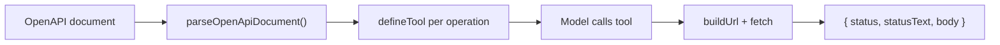

## What this is

**OpenAPI** is a standard file format for describing a REST API — its endpoints, parameters, and request bodies. `openApiTools()` reads an OpenAPI 3.0/3.1 document and produces one `DefinedTool` per operation, so a model can call a real HTTP API through the normal tool pipeline. The document is parsed once at setup; each tool's `execute` is a dumb straight-line request builder — build the URL, send it, shape the response (N8). Think of it as a translator: API documentation in, a box of ready-made tools out. It exists so an agent can drive an existing REST API without anyone hand-writing a tool per endpoint — and without the model ever holding credentials or picking raw URLs.

## The mental model



Four nouns to hold onto:

- **Operation** — one `METHOD /path` pair in the document; becomes one tool.
- **`providedArguments`** — app-supplied values (tenant ids, fixed params) hidden from the model's schema.
- **`approval: 'mutating'`** — the default: GET/HEAD/OPTIONS run free, everything else asks.
- **SSRF pinning** — refusing calls that resolve to private/internal network addresses (server-side request forgery: tricking a server into requesting attacker-chosen hosts).
- **`OpenApiToolResult`** — `{ status, statusText, body }`, the shape every operation's `execute` returns.

## How it works

1. **The document loads once.** The `document` argument accepts a parsed object, a JSON or YAML string, or an https URL (`openApiTools.ts`). URL fetches go through `fetchDocument()`: manual redirect following (max 3 hops, each hop re-checked), `https`-only except loopback, credentials-in-URL rejected, and `privateAddresses: 'refuse'` applies to the document fetch too, not just operation calls. A Swagger 2.x document is rejected with a pointer to `swagger2openapi`; remote `$ref`s are refused — bundle the document so every ref is local (`#/components/...`).
2. **Parsing walks `paths` × the seven methods** (`operations.ts`, pure — no network). `parseOpenApiDocument` normalizes OpenAPI 3.0's `nullable: true` into JSON Schema and resolves local `$ref` chains (≤16 hops). Per operation: the tool name is a sanitized `operationId`, else derived `<method>_<path>` (`get /orders/{id}` → `get_orders_id`), `prefix`-able to `<prefix>__<name>`, truncated to 64 chars, collision-checked up front. Path- and operation-level parameters merge (operation wins on `in:name` ties; `accept`/`content-type`/`authorization`/`host`/`content-length` headers are skipped; a name collision across locations renames to `<in>_<name>`). Only `application/json` (`+*/json`) bodies become an input key; other media types mark the operation `unsupported` — skipped by default, an explicit `include` of one throws. Description = `summary` + `description` capped at 1,000 chars, then `METHOD path` appended so the model always sees the wire shape. The input schema is one `{ type: 'object', properties, required }` whose `$ref`s `jsonSchemaToZod(schema, document)` resolves against the whole document.
3. **Each surviving operation becomes a `defineTool()`.** `providedArguments` are *pruned from the model-facing schema* and re-injected in `execute`, possibly per call via `(ctx) => value`. Approval defaults to `'mutating'` — GET/HEAD/OPTIONS run, everything else asks — overridable by `'always'`/`'never'`/`(op) => boolean`. Annotations follow the method: read-only ops get `readOnlyHint: true`; DELETE gets `destructiveHint: true`.
4. **`execute` builds and sends the request.** `buildUrl` substitutes path params with `encodeURIComponent` — but a whole-segment `.`/`..` is refused even percent-encoded, since URL parsing resolves `%2E%2E` — and serializes query params per `style`/`explode` (form/spaceDelimited/pipeDelimited/deepObject). `buildHeaders` applies parameter headers and cookies first, then configured `headers`/`bearerToken` **last** — a model-supplied `authorization` param can never override configured credentials. Redirects are followed manually, same-origin only (credentials stay on the configured origin), 303/301/302-after-POST downgrade to bodyless GET, max 3 hops. Timeout is `AbortSignal.timeout(timeoutMs ?? 30s)` combined with `ctx.abortSignal` via `AbortSignal.any`. The response becomes `{ status, statusText, body }` — JSON-parsed when the content-type says so (parse failure keeps text), capped at `maxResponseChars` (50k).
5. **SSRF refusal pins the connection.** `privateAddresses: 'refuse'` swaps in `createPinnedFetch()`: an undici `Agent` whose one DNS resolution per connection is checked against private/loopback/link-local ranges *and* is the address the socket connects to — no second lookup for DNS rebinding. IP literals and `localhost` names are checked on the URL itself at build time and on every redirect hop. `allowPrivate` whitelists host patterns; the option can't combine with a custom `fetch` (a custom fetch resolves names itself, so pinning would be unverifiable). Node-only; undici loads lazily.

## Under the hood

- **Failures are model-facing.** Request errors throw `toolFailure()` — `LOUSHO_TOOL_EXECUTION_FAILED` with `appendHelp: false`, because the message is the tool result the model reads, not a developer error.
- **Parse validates the whole selection.** `include` typos, name collisions, and unused `providedArguments` (`assertProvidedArgumentsUsed`) all throw inside `openApiTools()`, before any network call.
- **`jsonSchemaToZod` is shared.** MCP and OpenAPI both convert remote JSON Schema → zod; one permissive converter (`src/tools/mcp/schema.ts`) keeps behavior identical.
- **`OpenApiToolResult`** is the stable result shape `{ status, statusText, body }` — callers can branch on `status` without parsing text.
- **`parseDocumentText()`** handles the string form (JSON or YAML) separately from URL loading, so parsing is testable without any network.
- **The pinned `Agent` checks once, connects once.** The DNS answer that passed the private-range check is the same address the socket dials — the classic DNS-rebinding gap (approve one lookup, dial a different one) never opens.
- **`include`/`exclude` select operations by name** (or `operationId`, or an `(op) => boolean` predicate for `include`) before tools are built, and `prefix` keeps two APIs' `get` tools from colliding — the same job `server__tool` namespacing does for [MCP](/tools/mcp). *(inferred: parity of intent; the mechanism is `prefix`-in-name rather than automatic.)*
- **Naming is deterministic.** `toolNameFor()` prefers a sanitized `operationId` and falls back to `<method>_<path>` with `{param}` braces flattened — the model-facing name is stable across parses, which is what makes `include` lists and cached prompts reusable.

## In code

| Symbol | File | Role |
|---|---|---|
| `openApiTools()`, `OpenApiToolsOptions` | `src/tools/openapi/openApiTools.ts` | Document in → `DefinedTool`s out |
| `parseOpenApiDocument()`, `toolNameFor()`, `ParsedOperation` | `src/tools/openapi/operations.ts` | Pure spec → operation normalization |
| `privateAddressPolicy()`, `assertHostAllowed()`, `createPinnedFetch()` | `src/tools/openapi/privateAddresses.ts` | SSRF refusal + DNS pinning |
| `jsonSchemaToZod()` | `src/tools/mcp/schema.ts` | Shared JSON Schema → zod converter |
| `fetchDocument()` | `src/tools/openapi/openApiTools.ts` | Guarded document fetch (redirects, https, creds) |
| index | `src/tools/openapi/index.ts` | Public re-exports |

## Example

```ts
import { openApiTools, createAgent } from '@lousho/build-ai-agent';

const tools = await openApiTools('https://api.example.com/openapi.json', {
  prefix: 'orders',                    // tools named orders__getOrder, ...
  include: ['getOrder', 'refundOrder'],
  bearerToken: () => process.env.ORDERS_TOKEN ?? '',
  providedArguments: { tenant: 'acme' }, // hidden from the model's schema
  approval: (op) => op.method === 'DELETE', // custom: only deletes ask
  privateAddresses: 'refuse',
});

const agent = createAgent({ model: 'openai/gpt-4o-mini', tools });
```

`openApiTools` fetches the document once, picks the two `include`d operations, and names them `orders__getOrder` / `orders__refundOrder`. `bearerToken` is applied last when headers are built, so the model can't override it; `providedArguments.tenant` is injected at execute time without ever appearing in the model's schema. The custom `approval` narrows the `'mutating'` default to DELETEs only. `privateAddresses: 'refuse'` means a document or redirect pointing at `169.254.x.x` or a rebinding DNS answer is refused.

## Design decisions

- **Parse once, execute dumb.** All spec understanding happens in `openApiTools()`; `execute` is a straight-line request builder — cheaper tools, and the parse step validates the whole selection before any call.
- **Schema pruning for secrets.** `providedArguments` removes fields from what the model sees rather than letting the model supply (or guess) values the app overrides anyway.
- **Approval by HTTP method.** `'mutating'` mirrors the annotations default for MCP tools: read verbs run, write verbs ask — zero-config safe for the common case.
- **Same-origin redirects only.** Following a cross-origin redirect would forward configured `Authorization` headers to an attacker-chosen host.
- **Shared `jsonSchemaToZod`.** One permissive converter keeps MCP and OpenAPI behavior identical.

## Where next

- [Tool system](/tools/tool-system) — the descriptor contract these tools land in.
- [MCP](/tools/mcp) — the other spec-to-tools pipeline (shared `jsonSchemaToZod`).
- `docs/openapi-tools.md` — option reference and large-API guidance.
