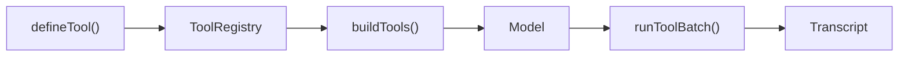

## What this is

The tool system turns a function you write into something a language model can call — and turns the model's call back into a result it can read. A **tool** is a named function plus a *schema*: a machine-readable description of its arguments, written in [zod](https://zod.dev) or a compatible schema library. Every tool in a run — user-defined, built-in, [MCP](/tools/mcp)-loaded, [OpenAPI](/tools/openapi-tools)-generated, or [provider-hosted](/tools/hosted-tools) — flows through one contract: a `ToolDescriptor` carrying an `inputSchema` and an `execute`. Think of it as a power strip: many plug shapes in, one socket shape out.

## The mental model



Four nouns to hold onto:

- **Descriptor** — the one shape every tool ends up in: `inputSchema` + `execute`.
- **Registry** — the name → descriptor map the run resolves tool names against.
- **Gate** — the per-call check (argument validation, permissions, approval) that runs *before* `execute`.
- **[Transcript](/glossary)** — the run's message list; tool results land here and the model reads them on its next call.

## How it works

1. **`defineTool()` validates and packages.** `defineTool({ name, description, input, execute })` (`src/tools/defineTool.ts`) checks eagerly: `name` must match `^[a-zA-Z0-9_-]{1,64}$` (the limit model providers impose on function names), `description` must be non-empty, and `input` must satisfy `isModelSchema()` — zod 3, zod 4, or any Standard Schema exposing `~standard.jsonSchema` (LOU-D29). Failures throw `ConfigurationError` (`LOUSHO_CONFIG_INVALID`) with a fix-it hint, at definition time rather than first call. The returned `DefinedTool` is a `ToolDescriptor` plus `name`, `input`, `inputSchema`, and a typed `execute`.
2. **Registration flattens every input shape.** `createAgent({ tools })` and `ToolRegistry.registerMany()` both call `toolEntries()` (`src/tools/toolEntries.ts`), which accepts a record keyed by name, arrays of named tools, or mixes like `[mcp.tools, weatherTool]`. A record key colliding with another entry throws immediately (the record form would otherwise overwrite silently); two `defineTool()` results under one name both pass through so `registerDefined()` throws its richer error naming both tools' `displayName`s. Hosted tools are skipped here — `assertHostedToolNames()` owns their collisions (see [hosted tools](/tools/hosted-tools)) — and MCP-loaded tools carry `server__tool` names so two servers can never collide.
3. **`buildTools()` makes descriptors model-facing.** `buildTools()` (`src/execution/generateStep.ts:41`) resolves each name in the registry and emits `{ type: 'function', function: { name, description, parameters } }`, where `parameters` is the raw zod/Standard-Schema object. Each provider's `convertTools` turns it into JSON Schema — zod 4 via `z.toJSONSchema`, zod 3 via the `ai` SDK converter; `jsonSchemaOf()` in `toolSearch.ts` is the same conversion used for token estimates and code-mode signatures.
4. **The model answers with calls; `runToolBatch()` runs them.** One [turn](/glossary)'s calls run through `runToolBatch()` (`src/execution/toolBatch.ts`): calls start in order, each only after the previous one cleared its *gate* — argument validation, permission rules, and the approval check — so the first call needing approval is identified before anything after it starts. A `Limiter` caps in-flight calls at `toolConcurrency` (default `'unbounded'`).
5. **Results and failures land in the transcript.** `recordPrefix()` appends completed calls as a contiguous prefix in call order and serializes `persist()` writes so an older snapshot never lands after a newer one. A `tool` message's content is `JSON.stringify(result)`; `undefined`/unserializable results become `null` (`toolResult.ts`). Failures become `toolErrorResult()` objects — `{ error, toolName, message, kind }`, message capped at 2,000 chars, `isError` on the message — so the model reads the failure and recovers instead of the run dying.

## Under the hood

- **One contract, two shapes.** `inputSchema`/`execute` are canonical; a `DefinedTool` also carries a legacy `.tool` field (`{ description, parameters, execute }`, the AI-SDK v4 shape) for hand-written descriptors. `toolContract.ts` (`getToolInputSchema()`, `getToolExecute()`, `toolDescriptorFromSchema()`, `legacyAiTool()`) is the one place the runtime reads either — canonical first, `tool.parameters`/`tool.execute` as independent fallbacks (LOU-D22).
- **Async-generator `execute`.** An `execute` that yields (N13b) passes through unchanged: each `yield` streams a `tool.partial` event and the last yield is the result.
- **Error kinds.** `toolErrorResult()` kinds are `execution | validation | not-found | rejected | not-run | mcp | sandbox | denied`; an error can declare its kind via a `toolErrorKind` property.
- **Approval is per-tool.** `needsApproval` is a boolean or `(args, ctx: ApprovalCheckContext) => ApprovalOutcome` where the outcome is `'ask' | 'approve' | 'deny' | { deny: reason } | boolean`. `always()`, `never()`, `once()` (`src/tools/approvalPolicies.ts`) are ready-made policies.
- **`once()` uses the transcript as memory.** Resuming an approved call marks its `tool` message with `metadata.approval` (`approvalMarker()`), so the memory survives durable resume in another process; `per: 'args'` keys it on a `cyrb53` hash of sorted-keys JSON. A `'deny'` outcome gives the model a `kind: 'denied'` tool error rather than pausing the run.

## In code

| Symbol | File | Role |
|---|---|---|
| `defineTool()`, `DefinedTool`, `isDefinedTool()` | `src/tools/defineTool.ts` | Tool factory; `assertValidOptions` at line 111 |
| `getToolInputSchema()`, `getToolExecute()`, `toolDescriptorFromSchema()` | `src/tools/toolContract.ts` | The only reads of a descriptor's schema and `execute` |
| `toolEntries()`, `ToolsOption` | `src/tools/toolEntries.ts` | Flattens every accepted `tools` shape to `[name, tool]` pairs |
| `ToolRegistry`, `globalToolRegistry` | `src/tools/ToolRegistry.ts` | Name → descriptor map; the process-wide default |
| `always()`, `never()`, `once()`, `approvalMarker()` | `src/tools/approvalPolicies.ts` | Ready-made `ApprovalPolicy` predicates |
| `ToolDescriptor`, `ApprovalOutcome`, `ToolExecutionContext` | `src/types/tool.ts` | The contract types |
| `buildTools()` | `src/execution/generateStep.ts` | Descriptor → provider `ToolDefinition` |
| `runToolBatch()`, `Limiter`, `ToolConcurrency` | `src/execution/toolBatch.ts` | Gated, capped parallel execution + ordered recording |
| `toolErrorResult()` | `src/execution/toolErrors.ts` | The `{ error, toolName, message, kind }` failure shape |

## Example

```ts
import { defineTool, once, createAgent } from '@lousho/build-ai-agent';
import { z } from 'zod';

const sendEmail = defineTool({
  name: 'send_email',
  description: 'Send an email',
  input: z.object({ to: z.string().email(), subject: z.string() }),
  needsApproval: once({ per: 'args' }), // ask once per distinct recipient set
  async execute({ to, subject }) {
    return { messageId: `${to}:${subject}` };
  },
});

const agent = createAgent({
  model: 'openai/gpt-4o-mini',
  tools: [sendEmail],
  toolConcurrency: 4, // a turn's calls run up to 4 at a time, recorded in order
});
```

`defineTool` gives `send_email` a validated name and a zod argument schema — `buildTools()` will present the model a function signature built from it. `needsApproval: once({ per: 'args' })` means the run pauses for a human the first time it sends to a given `{ to, subject }`, then remembers via the transcript. `toolConcurrency: 4` lets `runToolBatch()` overlap up to four calls; results are still recorded in call order.

## Design decisions

- **One contract, two shapes.** `toolContract.ts` centralizes the `inputSchema`/`.tool` fallback so no caller needs to know which field a tool set.
- **Validation at definition, not at call.** Failing fast in `defineTool()` surfaces a typo'd schema in a unit test, not inside a running agent.
- **Gate-before-start ordering.** `runToolBatch` never starts a call whose predecessors haven't cleared their gates — "the first call that needs approval" stays deterministic without serializing execution.
- **Transcript-as-memory for `once()`.** No separate approval state store: approvals are already what sessions and [checkpoints](/core/durable-execution) persist.
- **Errors are data.** Every failure path funnels into `ToolErrorResult` so the model can read and recover; runs almost never die from a tool error.

## Where next

- [Workspace tools](/tools/workspace-tools) — the built-in fs/shell tool set.
- [MCP](/tools/mcp) — `server__tool` namespacing and remote descriptors.
- [Tool search](/tools/tool-search) — `deferLoading` and transcript-derived loading.
- [Approvals](/core/approvals) — the approval gate, stores, and resume path.
